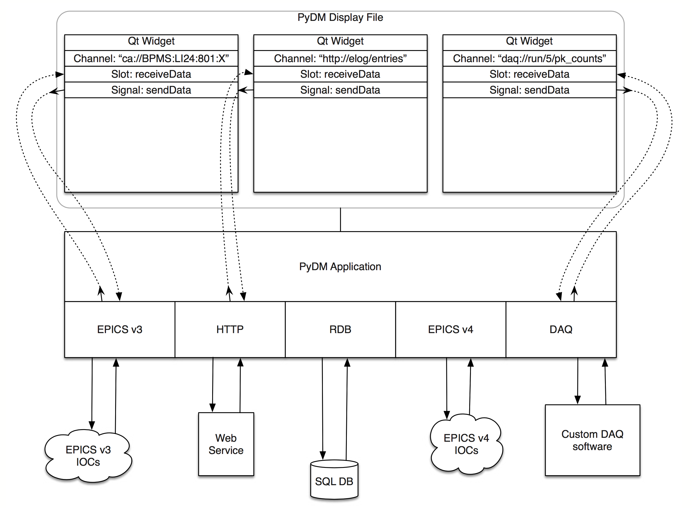
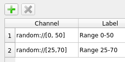
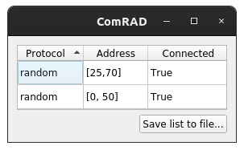
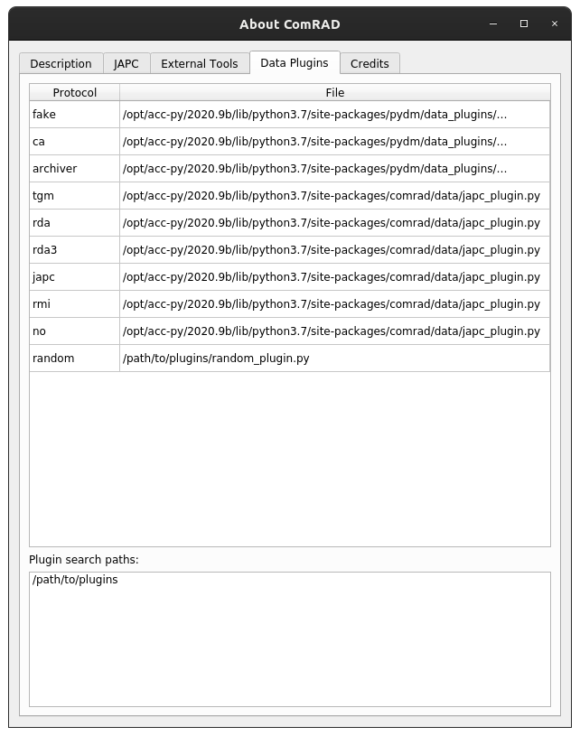

Data plugins
============

Data plugin system allows augmenting the default control system interfaces to pick up custom user-defined
protocols.

- `Overview`_
- `Adding custom plugins`_

  * `Specifying plugin search paths`_

- `Implementing plugins`_

  * `Plugins with GET/SET/SUBSCRIBE operations`_

- `Inspecting loaded plugins`_

Overview
--------

ComRAD ships with the default control system plugin, tailored for CERN's control system and its transport layers,
*JAPC* and *RDA*. :ref:`basic/controls:Channels` covers the supported protocols and address format for the bundled
control system plugin.

However, data plugin system is not limited to real-time remote sources only. In fact, it is source agnostic. It is
possible to create access points for various data sources, such as files, sockets, databases, HTTP endpoints and more.
This is enabled by the architecture of PyDM, the underlying framework of ComRAD.
`More information <https://slaclab.github.io/pydm-tutorial/intro/data_arch.html>`__.

   Data flux architecture

A good practical example for exposing alternative data source could be historical data. If an application relies not
only on the real-time data, but also needs to render archived historical data, an extra data plugin is a good
solution for decoupling the logic that retrieves historical data from the display/presentation logic of the application.

ComRAD examples also provide interesting alternative use-cases under the "Data Plugins" section, for example a
random number generator exposed as a *Data plugin*. Receiving random numbers becomes as easy as specifying channel
address with custom format.

   Custom channels configured in ComRAD Designer

The configuration above becomes valid, as long as the custom data plugin is loaded by ComRAD. To verify that channels
are indeed successfully picked up, it is possible to revisit the Connections dialog under menu
"View"→"Show connections...".

   Active connections in ComRAD runtime

It becomes evident that channel address can have arbitrary format and it is up to the data plugin to understand that
format, as previously highlighted in :ref:`basic/controls:Channels`.

Adding custom plugins
---------------------

Custom Data plugins are Python files that implement certain classes. Python files are searched for in
the paths supplied by the user. Plugin Python files must have filenames ending with ``_plugin``, e.g. ``my_plugin.py``.
Other Python files are ignored.

Specifying plugin search paths
^^^^^^^^^^^^^^^^^^^^^^^^^^^^^^

There's 2 ways to define plugin search paths:

#. Specify ``--extra-data-plugin-path`` command line argument in ``comrad run`` command. This argument can accept more
   than one path, if it is separated by empty space. If this argument comes last in your command, be sure to terminate
   the list of paths with ``--``, otherwise your ComRAD application's main file will be considered a search path, e.g.

   .. code-block:: bash

      comrad run --extra-data-plugin-path /path/to/plugins /another/path/to/plugins -- my_comrad_app.ui

#. Set the ``COMRAD_DATA_PLUGIN_PATH`` environment variable. This is useful when you are constantly using same plugins
   in multiple applications and prefer defining them once in ``.bashrc``, rather than providing it in ``comrad run``
   command every single time. This variable can include multiple paths separated by ``:``, e.g.
   ``/path/to/plugins:/another/path/to/plugins``.

When used in both environment variable and the command line argument, paths will be combined together. The precedence
is given to the paths from the command line argument.

..  # TODO: This should be added, when DESIGNER_ONLINE is implemented

    Using in ComRAD Designer
    ^^^^^^^^^^^^^^^^^^^^^^^^

    ComRAD Designer can receive custom

    - Same sources, activated only when DEsigner online (not yet implemented)
    - When opening file in Designer from comrad, arguments will be passed

Implementing plugins
--------------------

Custom data plugins normally declare 2 classes:

#. **Connection**: Your actual logic of marshaling data must reside here. There is one connection instance created
   per address. Attaching multiple widgets to the same channel address will result in a single connection instance
   that serves multiple "listeners". This declaration must subclass :class:`comrad.data_plugins.CDataConnection`.
#. **Plugin**: This class simply maps a *Connection* class to the protocol. Same *Connection* class can serve
   multiple protocols, by defining multiple **Plugin** classes. This is exactly how a single bundled ComRAD
   data connection class serves multiple protocols, such as ``rda://`` and ``tgm://``. This declaration must
   subclass :class:`comrad.data_plugins.CDataPlugin`.

To get a feeling of how it is composed, here's the example of random number generator data plugin:

.. literalinclude:: ../../_comrad_examples/g7_data_plugins/e1_basic_plugin/random_plugin.py
   :linenos:

Plugins with GET/SET/SUBSCRIBE operations
^^^^^^^^^^^^^^^^^^^^^^^^^^^^^^^^^^^^^^^^^

Besides the base :class:`~comrad.data_plugins.CDataConnection`, which is the most flexible in terms of
implementation, it is possible to subclass a more specialized :class:`comrad.data_plugins.CCommonDataConnection`
that is tailored for control system access points providing GET/SET/SUBSCRIBE operations.

- **GET**: retrieves/pulls a single value on request
- **SUBSCRIBE**: values are pushed repeatedly by the control system to the subscribed parties
- **SET**: writes the data entered by the user from the UI into the control system

:class:`~comrad.data_plugins.CCommonDataConnection` defines a skeleton to implement these operations. In addition,
it does several assumptions:

- GET operation must be asynchronous to not block the UI
- GET and SUBSCRIBE are expected to have the same signature of the callback, as the data is processed by the same
  piece of logic.

Most ComRAD widgets utilize SUBSCRIBE operations to regularly update their values.
:class:`~comrad.data_plugins.CCommonDataConnection` implements "request" logic, that issues a GET on user's
request, e.g. when hitting a "Get" button in :ref:`cpropertyedit` widget.

Inspecting loaded plugins
-------------------------

When user has ``COMRAD_DATA_PLUGIN_PATH`` defined, it gets reflected in ``comrad --version`` command, that prints
the search paths after the version information, e.g.:

.. code-block:: bash

   $ COMRAD_DATA_PLUGIN_PATH=/path/to/plugins comrad --version
   ComRAD 0.1b5

   Based on:
   ---------
   Acc-py Widgets v0.4
   PyJAPC v2.1.2
   Java Dependency Manager v2.6.0
   PyDM v1.8.0.post0
   NumPy v1.19.1
   PyQtGraph v0.10.0.post0

   Environment:
   ------------
   PyQt v5.12.3
   Qt v5.12.9
   Python v3.7.7

   User-defined ComRAD data plugin paths:
    * /path/to/plugins

In addition, user is able to inspect loaded plugins at runtime. Open menu "File"→"About ComRAD" and navigate to
the "Data Plugins" tab.

   "Data Plugins" tab with the loaded custom data plugin

Loaded plugins appear in the list together with the standard protocol handlers. Furthermore, "Plugin search paths"
become visible listing all the extra paths that are searched for the plugins.
