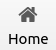
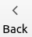
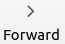
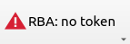

Window plugins
==============

Window plugin system allows customizing the appearance of the concrete application to include new
application-specific features or hide unnecessary standard features. Some standard functionality, such as
RBAC button, is implemented using the same plugin system.

- `Overview`_

  * `Enabling/disabling plugins`_
  * `Configuring plugins at launch`_

- `Navigation bar plugins`_

  * `Reordering navigation bar items`_

- `Menu plugins`_
- `Status bar plugins`_
- `Creating a new window plugin`_

Overview
--------

Window plugins could be split in 2 categories: Action-based plugins and Widget-based plugins.

Action-based plugins render standard UI control based on the type, expect a single command to be triggered by
the plugin and rely on Qt abstraction concept, called `QAction <https://doc.qt.io/qt-5/qaction.html#details>`__.

   "In applications many common commands can be invoked via menus, toolbar buttons, and keyboard shortcuts.
   Since the user expects each command to be performed in the same way, regardless of the user interface used,
   it is useful to represent each command as an action.

   Actions can be added to menus and toolbars, and will
   automatically keep them in sync. For example, in a word processor, if the user presses a **Bold** toolbar button,
   the **Bold** menu item will automatically be checked."

Widget-based plugins, in contrast, do not expect a mandatory command to be triggered. Instead, they allow
rendering an arbitrary widget. If that widget must to trigger an action, it's developer's responsibility to
ensure that.

These categories can be applied to the following types:

- *Action-based*: `Navigation bar plugins`_, `Menu plugins`_
- *Widget-based*: `Navigation bar plugins`_, `Status bar plugins`_

In addition, `Navigation bar plugins`_ and `Status bar plugins`_ are positional. It means, they can be snapping either
to the left edge of the bar, or the right. If several plugins lean towards the same side, the decision who becomes the
outermost item is made in accordance with their :attr:`~comrad.app.plugins.CPositionalPlugin.gravity` value. Gravity
represents the priority, and the higher value will push the item further towards the edge.

Each plugin must have a unique identifier (:attr:`~comrad.app.plugins.CPlugin.plugin_id`), no matter the type of the
plugin. For this reason, we suggest the reverse-domain notation identifiers, e.g. ``org.example.my-plugin``. Bundled
ComRAD plugins always start with ``comrad.`` prefix.

Enabling/disabling plugins
^^^^^^^^^^^^^^^^^^^^^^^^^^

Sometimes it is useful to disable (hide) default plugins, or enable some plugin that is not used by default (every
plugin specifies if it is enabled or disabled by default). One use-case could be hiding RBAC button (|rba|) for
applications that do not care about authentication or authorization. In their case, RBAC button does not add additional
value, and red icon due to the failed login on startup may scare users who are not acquainted with the system. ComRAD
CLI provides flags to enable or disable plugins, e.g.

.. code-block:: bash

   comrad run \
     --enable-plugins org.example.my-plugin \
     --disable-plugins comrad.rbac org.example.my-another-plugin

Configuring plugins at launch
^^^^^^^^^^^^^^^^^^^^^^^^^^^^^

Widget-based plugins can be reconfigured at launch. For that, ``--window-plugin-config`` command line argument can be
used. It consumes key-value pairs, separated by ``=``, where key is prefixed with the plugin's ID. This flag can take
multiple values, allowing to pass one or more settings to one or more widget-based window plugins. E.g.

.. code-block:: bash

   comrad run \
     --window-plugin-config \
       org.example.my-plugin.setting1=val1 \
       org.example.my-plugin.setting2=val2 \
       org.example.my-another-plugin.setting1=val3

will pass ``setting1`` and ``setting2`` to plugin with ID ``org.example.my-plugin``, as well as ``setting1`` to plugin
with ID ``org.example.my-another-plugin``.

Navigation bar plugins
----------------------

This kind of plugins are placed in the main navigation bar on the right hand side after main navigation buttons:
|back|, |fwd| and |home|. If the plugin is configured to be placed on the right, it will have compete
for the position with standard buttons, such as RBAC or PLS, in accordance with its
:attr:`~comrad.app.plugins.CPositionalPlugin.gravity` value.

Action-based toolbar plugins also trigger menu creation "Plugins"→"Toolbar" To avoid that from happening, plugin may
set its :attr:`~comrad.app.plugins.CToolbarActionPlugin.show_in_menu` to ``False``.

To load custom navigation bar plugins into the application, specify the search path during the launch, and make sure
containing files inside have the filename ending with ``_plugin.py``:

.. code-block:: bash

   comrad run \
     --nav-plugin-path /path/to/my/plugins/directory \
     /path/to/my/app.ui

Reordering navigation bar items
^^^^^^^^^^^^^^^^^^^^^^^^^^^^^^^

In situations when you want to redefine default placement of the navigation bar items, or hide some standard items,
such as navigation controls (|back|, |fwd|, |home|) completely, you can define a custom order. In this case,
plugin :attr:`~comrad.app.plugins.CPositionalPlugin.gravity` is ignored, and you have to place spacers to separate left
from the right, e.g.:

.. code-block:: bash

   comrad run --nav-bar-order \
     org.example.my-plugin comrad.sep comrad.spacer comrad.home \
     /path/to/my/app.ui

:class:`~comrad.app.plugins.CToolbarID` provides all known values for non-plugin items inside the navigation bar, such as
navigation buttons.

Menu plugins
------------

Menu plugins can create either single entries or tries of menus in the menu bar. See
:class:`~comrad.app.plugins.CMenuBarPlugin` for details.

Status bar plugins
------------------

Status bar plugins are placed in the respective are in the bottom of the main window (unless status bar is hidden).
Usually, that are is dedicated to displaying status information and/or short messages, such as file loading text.

Besides position (left/right), status bar items can be permanent (or not, see
:attr:`~comrad.app.plugins.CStatusBarPlugin.is_permanent`). This is the concept of `Qt status bar
<https://doc.qt.io/qt-5/qstatusbar.html#details>`__. Permanent widgets will be placed on the right
hand side from temporary ones to minimize the likelihood of overlapping with temporary messages. This will override
the preference defined by the :attr:`~comrad.app.plugins.CPositionalPlugin.position` property.

Creating a new window plugin
----------------------------

To create a custom plugin, make a new file with filename suffix ``_plugin.py``. Inside, create one or more subclasses
of the appropriate base classes, specify plugin properties, and sometimes define new widgets:

.. code-block:: python
   :linenos:

   from qtpy.QtWidgets import QLabel
   from comrad import CToolbarActionPlugin, CToolbarWidgetPlugin
   # Other options: CStatusBarPlugin, CMenuBarPlugin

   class DemoActionPlugin(CToolbarActionPlugin):
       plugin_id = 'org.example.my-action-plugin'
       shortcut = 'Ctrl+Shift+B'
       icon = 'android'  # Taken from fontawesome map available in PyDM

       def triggered(self):
           print('Action triggered!')

       def title(self) -> str:
           return 'Click me!'

   class DemoWidgetPlugin(CToolbarWidgetPlugin):
       plugin_id = 'org.example.my-widget-plugin'

       def create_widget(self, _):
           lbl = QLabel("I'm a demo plugin!")
           lbl.setIndent(10)
           return lbl

