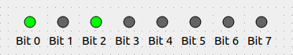

.. rst_epilog sometimes fails, so we need to include this explicitly, for colors
.. include:: <s5defs.txt>

.. _cbyteindicator:

CByteIndicator
=====================

- `Description`_

  * `Supported data types`_
  * `Inheritance diagram`_

- `API reference`_

Description
-----------

:class:`~comrad.CByteIndicator` displays a row of LEDs useful to represent a **continuous** array of bits. You can
adjust the number of bits displayed, but no gaps are intended, i.e. if you wish to display only 1st, 3rd and 5th bit,
consider converting them to individual boolean fields. Currently, it is a non-interactive widget, meaning that you
cannot reset the value of individual bits by clicking on the widget.

You can display a value from the control system inside :class:`~comrad.CByteIndicator` by setting its
:attr:`~comrad.CByteIndicator.channel` value to the address of your device-property's field.

.. seealso:: :ref:`What is a channel? <basic/controls:Channels>`

:class:`~comrad.CByteIndicator` is meant to work with either integer values (representing their individual bits as
booleans), enum sets, or boolean array. You can also use it with plain boolean, but in that case you are better off
with :ref:`cled`. Strings are not supported, and floating-point, while will work by being converted to integers, are
really not encouraged.

When used with any kind of arrays, widget will assume ``True`` for any non-zero element in the array and represent it
accordingly. If used with 2D-arrays, it will normalize the dimension to 1D-array by serializing rows of the matrix.

:class:`~comrad.CByteIndicator` supports client-side data transformations via
:attr:`~comrad.CByteIndicator.valueTransformation` that lets you modify displayed value with a piece of Python code.

.. seealso:: :doc:`What is client-side data transformations? <../../basic/transform>`

Supported data types
^^^^^^^^^^^^^^^^^^^^

============  ============  ============  =========  =========  =========  ============  =========  ============  ============  ============  ============  ==========  ===========  ===========  ============  ============  ============  ============  =============  =============  ==============
short         int           long          float      double     string     boolean       enum       enumSet       shortArray    intArray      longArray     floatArray  doubleArray  stringArray  booleanArray  intArray2D    longArray2D   floatArray2D  doubleArray2D  stringArray2D  booleanArray2D
------------  ------------  ------------  ---------  ---------  ---------  ------------  ---------  ------------  ------------  ------------  ------------  ----------  -----------  -----------  ------------  ------------  ------------  ------------  -------------  -------------  --------------
:green:`Yes`  :green:`Yes`  :green:`Yes`  :red:`No`  :red:`No`  :red:`No`  :green:`Yes`  :red:`No`  :green:`Yes`  :green:`Yes`  :green:`Yes`  :green:`Yes`  :red:`No`   :red:`No`    :red:`No`    :green:`Yes`  :green:`Yes`  :green:`Yes`  :red:`No`     :red:`No`      :red:`No`      :green:`Yes`
============  ============  ============  =========  =========  =========  ============  =========  ============  ============  ============  ============  ==========  ===========  ===========  ============  ============  ============  ============  =============  =============  ==============

Inheritance diagram
^^^^^^^^^^^^^^^^^^^

.. inheritance-diagram:: comrad.CByteIndicator
    :parts: 1
    :top-classes: PyQt5.QtWidgets.QWidget

API reference
-------------

.. autoclass:: comrad.CByteIndicator
    :members:
    :inherited-members: