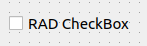

.. rst_epilog sometimes fails, so we need to include this explicitly, for colors
.. include:: <s5defs.txt>

.. _ccheckbox:

CCheckBox
=====================

- `Description`_

  * `Supported data types`_
  * `Inheritance diagram`_

- `API reference`_

Description
-----------

:class:`~comrad.CCheckBox` allows you setting boolean or integer (0 or 1) value in the control system.

You can connect it to the control system by setting its :attr:`~comrad.CCheckBox.channel` value to the address of your
device-property's field.

.. seealso:: :ref:`What is a channel? <basic/controls:Channels>`

:class:`~comrad.CCheckBox` supports client-side data transformations via :attr:`~comrad.CCheckBox.valueTransformation`
that lets you modify displayed value with a piece of Python code.

.. seealso:: :doc:`What is client-side data transformations? <../../basic/transform>`

Supported data types
^^^^^^^^^^^^^^^^^^^^

============  ============  ============  =========  =========  =========  ============  =========  =========  ==========  =========  =========  ==========  ===========  ===========  ============  ============  ============  ============  =============  =============  ==============
short         int           long          float      double     string     boolean       enum       enumSet    shortArray  intArray   longArray  floatArray  doubleArray  stringArray  booleanArray  intArray2D    longArray2D   floatArray2D  doubleArray2D  stringArray2D  booleanArray2D
------------  ------------  ------------  ---------  ---------  ---------  ------------  ---------  ---------  ----------  ---------  ---------  ----------  -----------  -----------  ------------  ------------  ------------  ------------  -------------  -------------  --------------
:green:`Yes`  :green:`Yes`  :green:`Yes`  :red:`No`  :red:`No`  :red:`No`  :green:`Yes`  :red:`No`  :red:`No`  :red:`No`   :red:`No`  :red:`No`  :red:`No`   :red:`No`    :red:`No`    :red:`No`     :red:`No`     :red:`No`     :red:`No`     :red:`No`      :red:`No`      :red:`No`
============  ============  ============  =========  =========  =========  ============  =========  =========  ==========  =========  =========  ==========  ===========  ===========  ============  ============  ============  ============  =============  =============  ==============

Inheritance diagram
^^^^^^^^^^^^^^^^^^^

.. inheritance-diagram:: comrad.CCheckBox
    :parts: 1
    :top-classes: PyQt5.QtWidgets.QCheckBox

API reference
-------------

.. autoclass:: comrad.CCheckBox
    :members:
    :inherited-members: