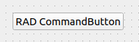

.. rst_epilog sometimes fails, so we need to include this explicitly, for colors
.. include:: <s5defs.txt>

.. _ccommandbutton:

CCommandButton
=====================

- `Description`_

  * `Supported data types`_
  * `Inheritance diagram`_

- `API reference`_

Description
-----------

:class:`~comrad.CCommandButton` is meant to issue commands. Commands are device properties with no fields inside them
and the button issues a SET instruction without any value. Since it's a write-only widget, it does not create any
subscriptions.

.. note:: In contrast with other buttons, it operates on the property level, not field.

You can connect it to the control system by setting its :attr:`~comrad.CCommandButton.channel` value to the address of
your device-property.

.. seealso:: :ref:`What is a channel? <basic/controls:Channels>`

Supported data types
^^^^^^^^^^^^^^^^^^^^

=========  =========  =========  =========  =========  =========  =========  =========  =========  ==========  =========  =========  ==========  ===========  ===========  ============  ============  ============  ============  =============  =============  ==============
short      int        long       float      double     string     boolean    enum       enumSet    shortArray  intArray   longArray  floatArray  doubleArray  stringArray  booleanArray  intArray2D    longArray2D   floatArray2D  doubleArray2D  stringArray2D  booleanArray2D
---------  ---------  ---------  ---------  ---------  ---------  ---------  ---------  ---------  ----------  ---------  ---------  ----------  -----------  -----------  ------------  ------------  ------------  ------------  -------------  -------------  --------------
:red:`No`  :red:`No`  :red:`No`  :red:`No`  :red:`No`  :red:`No`  :red:`No`  :red:`No`  :red:`No`  :red:`No`   :red:`No`  :red:`No`  :red:`No`   :red:`No`    :red:`No`    :red:`No`     :red:`No`     :red:`No`     :red:`No`     :red:`No`      :red:`No`      :red:`No`
=========  =========  =========  =========  =========  =========  =========  =========  =========  ==========  =========  =========  ==========  ===========  ===========  ============  ============  ============  ============  =============  =============  ==============

Inheritance diagram
^^^^^^^^^^^^^^^^^^^

.. inheritance-diagram:: comrad.CCommandButton
    :parts: 1
    :top-classes: PyQt5.QtWidgets.QPushButton

API reference
-------------

.. autoclass:: comrad.CCommandButton
    :members:
    :inherited-members: