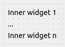

.. rst_epilog sometimes fails, so we need to include this explicitly, for colors
.. include:: <s5defs.txt>

.. _ccontextframe:

CContextFrame
=====================

- `Description`_

  * `Supported data types`_
  * `Inheritance diagram`_

- `API reference`_

Description
-----------

:class:`~comrad.CContextFrame` is a container that allows updating its child widgets with a new control-system context
by redefining context-related properties, such as cycle selector or data filters.
:ref:`Read more about contexts <basic/controls:Contexts>`. This allows a group of widgets to connect in a different way
than the rest of the application (application-level cycle selector is chosen via PLS toolbar button, and data filters
are undefined by default). You can assign a custom selector in ComRAD Designer by setting
:attr:`~comrad.CContextFrame.selector` property.

:class:`~comrad.CContextFrame` can redefine or inherit properties of the parent context, by manipulating
:attr:`~comrad.CContextFrame.inheritSelector` and :attr:`~comrad.CContextFrame.inheritDataFilters`.

Moreover, this widget allows redefining context properties in the runtime. Thus, you can create a custom selector widget
and connect its signals to one of the :class:`~comrad.CContextFrame`'s slots, e.g.
:attr:`~comrad.CContextFrame.updateSelector` or :attr:`~comrad.CContextFrame.updateDataFilters`. Use-cases could be:

* Dynamic selection of the device or property.
* Dynamic selection of the cycle / timing user.
* Dynamic selection of the data filter.

.. note:: This widget does not support dynamic movement between different parents. That is, if you add
          it to view hierarchy, display it, and then decide to move via :meth:`~QWidget.setParent`, its logic will break.

Supported data types
^^^^^^^^^^^^^^^^^^^^

.. note:: This widget does not interact with the control system directly.

Inheritance diagram
^^^^^^^^^^^^^^^^^^^

.. inheritance-diagram:: comrad.CContextFrame
    :parts: 1
    :top-classes: PyQt5.QtWidgets.QFrame

API reference
-------------

.. autoclass:: comrad.CContextFrame
    :members:
    :inherited-members: