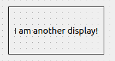

.. rst_epilog sometimes fails, so we need to include this explicitly, for colors
.. include:: <s5defs.txt>

.. _cembeddeddisplay:

CEmbeddedDisplay
=====================

- `Description`_

  * `Supported data types`_
  * `Inheritance diagram`_

- `API reference`_

Description
-----------

:class:`~comrad.CEmbeddedDisplay` renders another file inside a frame, allowing displays to be nested inside each other.
It works with both Designer (\*.ui) and Python (\*.py) files, which you specify in
:attr:`~comrad.CEmbeddedDisplay.filename` property. If the name starts with ``/`` symbol, it will be treated as an
absolute path. Otherwise, path will stay relative to the location of the file that contains the
:class:`~comrad.CEmbeddedDisplay` instance. If you want to embed multiple displays of the same type, take a look at
:ref:`ctemplaterepeater`.

Whenever you use a Python-based embedded display, that file must declare a single :ref:`cdisplay` subclass.
You can parametrize embedded display via :attr:`~comrad.CEmbeddedDisplay.macros` property.

.. seealso:: :doc:`What is macros? <../../basic/macros>`

This widget will try to optimize the performance and will load the embedded display, only when it becomes visible. You
can opt-out from this behavior by setting :attr:`~comrad.CEmbeddedDisplay.loadWhenShown` to ``False``. Similarly,
:attr:`~comrad.CEmbeddedDisplay.disconnectWhenHidden` will have an opposite effect during the hide event.

If you have to traverse the widget hierarchy up or down between embedded widgets and top-level application widgets, you
can do that, as your rendered embedded display is available on :attr:`~comrad.CEmbeddedDisplay.embedded_widget`
property.

Supported data types
^^^^^^^^^^^^^^^^^^^^

.. note:: This widget does not connect to the control system.

Inheritance diagram
^^^^^^^^^^^^^^^^^^^

.. inheritance-diagram:: comrad.CEmbeddedDisplay
    :parts: 1
    :top-classes: PyQt5.QtWidgets.QFrame

API reference
-------------

.. autoclass:: comrad.CEmbeddedDisplay
    :members:
    :inherited-members: