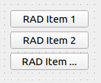

.. rst_epilog sometimes fails, so we need to include this explicitly, for colors
.. include:: <s5defs.txt>

.. _cenumbutton:

CEnumButton
=====================

- `Description`_

  * `Supported data types`_
  * `Inheritance diagram`_

- `API reference`_

Description
-----------

:class:`~comrad.CEnumButton` is a button group (similar to radio button group) that contains user-defined options.
Active button is chosen by either integer value, representing the index, string value that matches the button name,
or enum value, whose label also matches the button name.

You can connect it to the control system by setting its :attr:`~comrad.CEnumButton.channel` value to the address of
your device-property's field.

.. seealso:: :ref:`What is a channel? <basic/controls:Channels>`

:class:`~comrad.CEnumButton` supports client-side data transformations via
:attr:`~comrad.CEnumButton.valueTransformation` that lets you modify displayed value with a piece of Python code.

.. seealso:: :doc:`What is client-side data transformations? <../../basic/transform>`

Supported data types
^^^^^^^^^^^^^^^^^^^^

============  ============  ============  =========  =========  ============  =========  ============  =========  ==========  =========  =========  ==========  ===========  ===========  ============  ============  ============  ============  =============  =============  ==============
short         int           long          float      double     string        boolean    enum          enumSet    shortArray  intArray   longArray  floatArray  doubleArray  stringArray  booleanArray  intArray2D    longArray2D   floatArray2D  doubleArray2D  stringArray2D  booleanArray2D
------------  ------------  ------------  ---------  ---------  ------------  ---------  ------------  ---------  ----------  ---------  ---------  ----------  -----------  -----------  ------------  ------------  ------------  ------------  -------------  -------------  --------------
:green:`Yes`  :green:`Yes`  :green:`Yes`  :red:`No`  :red:`No`  :green:`Yes`  :red:`No`  :green:`Yes`  :red:`No`  :red:`No`   :red:`No`  :red:`No`  :red:`No`   :red:`No`    :red:`No`    :red:`No`     :red:`No`     :red:`No`     :red:`No`     :red:`No`      :red:`No`      :red:`No`
============  ============  ============  =========  =========  ============  =========  ============  =========  ==========  =========  =========  ==========  ===========  ===========  ============  ============  ============  ============  =============  =============  ==============

Inheritance diagram
^^^^^^^^^^^^^^^^^^^

.. inheritance-diagram:: comrad.CEnumButton
    :parts: 1
    :top-classes: PyQt5.QtWidgets.QWidget

API reference
-------------

.. autoclass:: comrad.CEnumButton
    :members:
    :inherited-members: