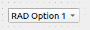

.. rst_epilog sometimes fails, so we need to include this explicitly, for colors
.. include:: <s5defs.txt>

.. _cenumcombobox:

CEnumComboBox
=====================

- `Description`_

  * `Supported data types`_
  * `Inheritance diagram`_

- `API reference`_

Description
-----------

:class:`~comrad.CEnumComboBox` contains user-defined options. Active option is chosen by either integer value,
representing the index, string value that matches the option name, or enum value, whose label also matches the option
name.

You can connect it to the control system by setting its :attr:`~comrad.CEnumComboBox.channel` value to the address of
your device-property's field.

.. seealso:: :ref:`What is a channel? <basic/controls:Channels>`

When used with enums, :class:`~comrad.CEnumComboBox` can display a value that is not-settable in a read-only mode.
"settable" really represents the permission for the user to send such value to the control system. For instance, one may
have a enum called "State", defined as follows:

#. *ON*: settable = ``True``
#. *OFF*: settable = ``True``
#. *BUSY*: settable = ``False``

In this example, "BUSY" should never be set by the user, but may arrive from the control system.
:class:`~comrad.CEnumComboBox` is capable of displaying that, but never allows setting it.

.. note:: Due to the way :class:`QComboBox` works, this read-only non-settable value display will be reset when user
          tries to interact with the combobox (until the next update from the control system).

:class:`~comrad.CEnumComboBox` supports client-side data transformations via
:attr:`~comrad.CEnumComboBox.valueTransformation` that lets you modify displayed value with a piece of Python code.

.. seealso:: :doc:`What is client-side data transformations? <../../basic/transform>`

Supported data types
^^^^^^^^^^^^^^^^^^^^

============  ============  ============  =========  =========  ============  =========  ============  =========  ==========  =========  =========  ==========  ===========  ===========  ============  ============  ============  ============  =============  =============  ==============
short         int           long          float      double     string        boolean    enum          enumSet    shortArray  intArray   longArray  floatArray  doubleArray  stringArray  booleanArray  intArray2D    longArray2D   floatArray2D  doubleArray2D  stringArray2D  booleanArray2D
------------  ------------  ------------  ---------  ---------  ------------  ---------  ------------  ---------  ----------  ---------  ---------  ----------  -----------  -----------  ------------  ------------  ------------  ------------  -------------  -------------  --------------
:green:`Yes`  :green:`Yes`  :green:`Yes`  :red:`No`  :red:`No`  :green:`Yes`  :red:`No`  :green:`Yes`  :red:`No`  :red:`No`   :red:`No`  :red:`No`  :red:`No`   :red:`No`    :red:`No`    :red:`No`     :red:`No`     :red:`No`     :red:`No`     :red:`No`      :red:`No`      :red:`No`
============  ============  ============  =========  =========  ============  =========  ============  =========  ==========  =========  =========  ==========  ===========  ===========  ============  ============  ============  ============  =============  =============  ==============

Inheritance diagram
^^^^^^^^^^^^^^^^^^^

.. inheritance-diagram:: comrad.CEnumComboBox
    :parts: 1
    :top-classes: PyQt5.QtWidgets.QComboBox

API reference
-------------

.. autoclass:: comrad.CEnumComboBox
    :members:
    :inherited-members:
