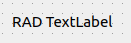

.. rst_epilog sometimes fails, so we need to include this explicitly, for colors
.. include:: <s5defs.txt>

.. _clabel:

CLabel
=====================

- `Description`_

  * `Supported data types`_
  * `Inheritance diagram`_

- `API reference`_

Description
-----------

:class:`~comrad.CLabel` is one of the simplest widgets that is meant to display static text, without user interaction. While it builds
on top of :class:`QLabel` (thus providing capabilities to display rich text, images and movies), it really makes sense
to use it to display text-based values arriving from the control system, and leave other functions to pure
:class:`QLabel`, which you can also use in ComRAD applications.

You can display a value from the control system inside :class:`~comrad.CLabel` by setting its
:attr:`~comrad.CLabel.channel` value to the address of your device-property's field.

.. seealso:: :ref:`What is a channel? <basic/controls:Channels>`

:class:`~comrad.CLabel` is capable of representing numeric values in different notations, controlled by
:attr:`~comrad.CLabel.displayFormat`, such as decimal, exponential, binary, and hexadecimal. For decimal values it is
also important to note the :attr:`~comrad.CLabel.precision` property that limits the amount of digits after decimal
point. Note that by default it's set to 0, thus hiding fractional part of the number.
:attr:`~comrad.CLabel.DisplayFormat.String` type will force the value into the string representation.

.. note:: When used to display Enums, :attr:`~comrad.CLabel.displayFormat` plays crucial role of what actually to display.
          Because Enum has several fields, :class:`~comrad.CLabel` tries to be flexible enough to allow displaying any
          of those. As such, you must use :attr:`~comrad.CLabel.DisplayFormat.String` in order to display "label" of
          the enum, or :attr:`~comrad.CLabel.DisplayFormat.Decimal` to display "code" of the enum. When left as
          :attr:`~comrad.CLabel.DisplayFormat.Default`, the widget won't try to guess the field and will pass the entire
          enum object further. This can be useful when you have your own :attr:`~comrad.CLabel.valueTransformation` and
          would like to handle enums manually.

:class:`~comrad.CLabel` supports client-side data transformations via :attr:`~comrad.CLabel.valueTransformation`
that lets you modify displayed value with a piece of Python code.

.. seealso:: :doc:`What is client-side data transformations? <../../basic/transform>`

:class:`~comrad.CLabel` can be assigned custom font color via widget rules.

.. seealso:: :doc:`What is widget rules? <../../basic/rules>`

Supported data types
^^^^^^^^^^^^^^^^^^^^

============  ============  ============  ============  ============  ============  ============  ============  =========  ==========  =========  =========  ==========  ===========  ===========  ============  ==========  ===========  ============  =============  =============  ==============
short         int           long          float         double        string        boolean       enum          enumSet    shortArray  intArray   longArray  floatArray  doubleArray  stringArray  booleanArray  intArray2D  longArray2D  floatArray2D  doubleArray2D  stringArray2D  booleanArray2D
------------  ------------  ------------  ------------  ------------  ------------  ------------  ------------  ---------  ----------  ---------  ---------  ----------  -----------  -----------  ------------  ----------  -----------  ------------  -------------  -------------  --------------
:green:`Yes`  :green:`Yes`  :green:`Yes`  :green:`Yes`  :green:`Yes`  :green:`Yes`  :green:`Yes`  :green:`Yes`  :red:`No`  :red:`No`   :red:`No`  :red:`No`  :red:`No`   :red:`No`    :red:`No`    :red:`No`     :red:`No`   :red:`No`    :red:`No`     :red:`No`      :red:`No`      :red:`No`
============  ============  ============  ============  ============  ============  ============  ============  =========  ==========  =========  =========  ==========  ===========  ===========  ============  ==========  ===========  ============  =============  =============  ==============

Inheritance diagram
^^^^^^^^^^^^^^^^^^^

.. inheritance-diagram:: comrad.CLabel
    :parts: 1
    :top-classes: PyQt5.QtWidgets.QLabel

API reference
-------------

.. autoclass:: comrad.CLabel
    :members:
    :inherited-members: DisplayFormat