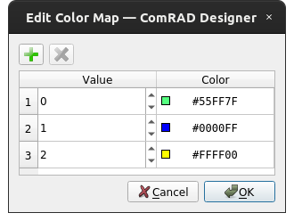

.. rst_epilog sometimes fails, so we need to include this explicitly, for colors
.. include:: <s5defs.txt>

.. _cled:

CLed
=====================

- `Description`_

  * `Supported data types`_
  * `Inheritance diagram`_

- `API reference`_

Description
-----------

.. image:: ../../img/widget_cled.png

:class:`~comrad.CLed` displays a single LED useful for representing binary values or other color-coded values. It is a
non-interactive (read-only) widget.

You can display a value from the control system inside :class:`~comrad.CLed` by setting its :attr:`~comrad.CLed.channel`
value to the address of your device-property's field.

.. seealso:: :ref:`What is a channel? <basic/controls:Channels>`

:class:`~comrad.CLed` is meant to work with booleans, integers and enums. When used with boolean, it will acquire one
of two colors, corresponding to its :attr:`~comrad.CLed.onColor` and :attr:`~comrad.CLed.offColor`. Integer will be
converted to :class:`Led.Status <accwidgets.led.led.Led.Status>`. When fed an enum, it will convert its
"meaning" field, into corresponding :class:`Led.Status <accwidgets.led.led.Led.Status>` value. Alternatively, it is
possible to define a :attr:`~comrad.CLed.color_map` that will relate integer values with colors when receiving integers,
or "code" field values when receiving enums. In ComRAD Designer, this property is edited via context menu "Edit Color
Map...".

   Designer editor for :attr:`~comrad.CLed.color_map` property

When reflecting a :class:`Led.Status <accwidgets.led.led.Led.Status>`, the widget will
receive a predefined color. However, it is capable of representing an arbitrary color (such as those defined in
:attr:`~comrad.CLed.onColor` and :attr:`~comrad.CLed.offColor` or returned from :attr:`~comrad.CLed.valueTransformation`
or rules).

:class:`~comrad.CLed` supports client-side data transformations via :attr:`~comrad.CLed.valueTransformation` that lets
you modify displayed value with a piece of Python code.

.. seealso:: :doc:`What is client-side data transformations? <../../basic/transform>`

:class:`~comrad.CLed` can be assigned custom color via widget rules.

.. seealso:: :doc:`What is widget rules? <../../basic/rules>`

.. note:: When using widget rules, make sure that it does not overlap with native :class:`~comrad.CLed` logic.
          For instance, if you intend to assign a color via widget rules, avoid using the "channel" property, because
          it will result in double evaluation:

          #. First, color will be calculated and assigned from the incoming value of the "channel"
          #. Afterwards, rule engine will evaluate and recalculate the color based on the rule. Here the value can
             be coming from the default "channel", or the custom one, defined in the rule.

          As a result, you may experience flickering.

          When not using "channel" property in the widget, for the rule to evaluate, it is required to provide a
          custom channel for the rule.

To summarize, suggested mechanisms to use are:

* *Incoming value is a boolean*: Use :attr:`~comrad.CLed.onColor` and :attr:`~comrad.CLed.offColor`
* *Incoming value is an integer, I want to display a custom color for specific values*: Use :attr:`~comrad.CLed.color_map`
* *Incoming value is an integer, I want to display a custom color for a specific range*: Use :doc:`widget rules<../../basic/rules>`
* *Incoming value is an integer, but corresponds to enum status (0=Unknown, 1=On, 2=Off, 3=Warning, 4=Error)*: Leave as is, it will acquire color based on the status
* *Incoming value is an enum, it has a proper "meaning" field*: Leave as is, it will acquire color based on the meaning
* *Incoming value is an enum, I want to display a custom color based on its "code" field*: Use :attr:`~comrad.CLed.color_map`
* *Incoming value is an enum, I want to display a custom color based on its "label" or "meaning" fields*: Use :doc:`widget rules<../../basic/rules>`
* *Incoming value is arbitrary, I want to define my own logic that selects the color*: Use :doc:`client-side data transformations <../../basic/transform>`

Supported data types
^^^^^^^^^^^^^^^^^^^^

============  ============  ============  =========  =========  =========  ============  ============  =========  ==========  =========  =========  ==========  ===========  ===========  ============  ============  ============  ============  =============  =============  ==============
short         int           long          float      double     string     boolean       enum          enumSet    shortArray  intArray   longArray  floatArray  doubleArray  stringArray  booleanArray  intArray2D    longArray2D   floatArray2D  doubleArray2D  stringArray2D  booleanArray2D
------------  ------------  ------------  ---------  ---------  ---------  ------------  ------------  ---------  ----------  ---------  ---------  ----------  -----------  -----------  ------------  ------------  ------------  ------------  -------------  -------------  --------------
:green:`Yes`  :green:`Yes`  :green:`Yes`  :red:`No`  :red:`No`  :red:`No`  :green:`Yes`  :green:`Yes`  :red:`No`  :red:`No`   :red:`No`  :red:`No`  :red:`No`   :red:`No`    :red:`No`    :red:`No`     :red:`No`     :red:`No`     :red:`No`     :red:`No`      :red:`No`      :red:`No`
============  ============  ============  =========  =========  =========  ============  ============  =========  ==========  =========  =========  ==========  ===========  ===========  ============  ============  ============  ============  =============  =============  ==============

Inheritance diagram
^^^^^^^^^^^^^^^^^^^

.. inheritance-diagram:: comrad.CLed
    :parts: 1
    :top-classes: PyQt5.QtWidgets.QWidget

API reference
-------------

.. autoclass:: comrad.CLed
    :members:
    :inherited-members:
