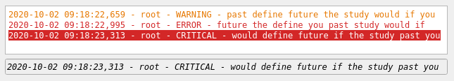
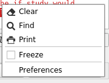
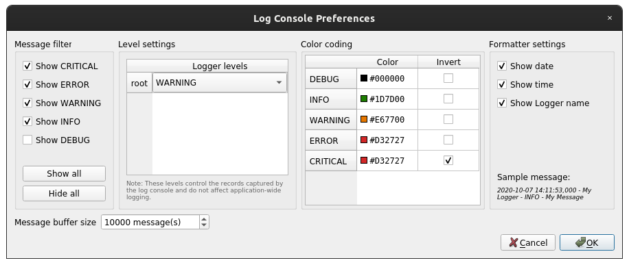
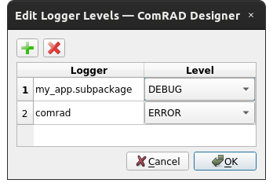

.. rst_epilog sometimes fails, so we need to include this explicitly, for colors
.. include:: <s5defs.txt>

.. _clogconsole:

CLogConsole
=====================

- `Description`_

  * `Main window integration`_
  * `Context menu`_
  * `Preferences`_
  * `Custom loggers`_
  * `Supported data types`_
  * `Inheritance diagram`_

- `API reference`_

Description
-----------

:class:`~comrad.CLogConsole` simply captures conventional Python :class:`logging.Logger` output to display messages
in the UI, when console output cannot be seen, e.g. when launched form CCM. These loggers are the same ones that are
usually used to print console messages (do not confuse with :func:`print` function), so you can capture ``stdout`` and
``stderr`` output here.

The last message is always duplicated in a single-line field and the color related to its severity level
is flashed in that field to attract end-user's attention. The widget has two modes: collapsed and expanded,
where a full log view is visible or hidden respectively. The single-line field of the last message is visible
in either mode.

.. note:: This component is **NOT** related to the logs archive systems, such as Timber / CALS / NXCALS.

Main window integration
^^^^^^^^^^^^^^^^^^^^^^^

While widget is available as an independent component for import in code and ComRAD Designer, main window of a
running ComRAD application also integrates a console using a dock widget in the bottom of the window. It is
visible by default, unless ``--hide-log-console`` flag was used during launch. It is encouraged to take advantage
of this default log console, as opposed to creating a custom one, unless there is a good reason.

Standard log console is configured to capture log of ComRAD and its main dependencies to provide fine control over the
severity levels of each of this components. For custom :class:`~comrad.CLogConsole` instances, user is free to
choose any set or subset of loggers.

Standard log console can be shown/hidden via main menu "View"→"Show Log Console" or right click menu over the navigation
bar or dock widget borders.

Context menu
^^^^^^^^^^^^

Log console provides a context menu on the right mouse click to:

- "Freeze"/"unfreeze" the console ("frozen" console becomes static and does not display new logs, until
  "unfrozen")
- Search for text visible in the console
- Print visible console logs
- Configure the display and capturing of the logs in a "Preferences" dialog

   Context menu of the log console

Preferences
^^^^^^^^^^^

Use can configure the captured logs and the display settings in the "Preferences" dialog accessible from the
:ref:`widgets/log_console/index:Context menu`.

   Preferences dialog

Log severity associated colors are configurable by the user under the "Color coding" group. When such color is
used as background rather than foreground (e.g. in last message field; or in the main text view, when color is
marked as "inverted") the foreground text color is chosen automatically between black and white, to have the best
contrast, based on the background's intensity.

Custom loggers
^^^^^^^^^^^^^^

When using a non-main window log console, it is possible to configure the widget with loggers to keep track of and
initial severity levels. This can be done via :attr:`~comrad.CLogConsole.loggers` property in code. For the ComRAD
Designer use-cases, use right-click context menu and open the "Edit Logger Levels..." dialog.

   Edit logger levels in Designer

Supported data types
^^^^^^^^^^^^^^^^^^^^

.. note:: This widget does not connect to the control system.

Inheritance diagram
^^^^^^^^^^^^^^^^^^^

.. inheritance-diagram:: comrad.CLogConsole
    :parts: 1
    :top-classes: PyQt5.QtWidgets.QWidget

API reference
-------------

.. autoclass:: comrad.CLogConsole
    :members:
    :inherited-members: