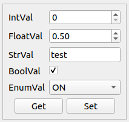

.. rst_epilog sometimes fails, so we need to include this explicitly, for colors
.. include:: <s5defs.txt>

.. _cpropertyedit:

CPropertyEdit
=====================

- `Description`_

  * `Supported data types`_
  * `Inheritance diagram`_

- `API reference`_

Description
-----------

:class:`~comrad.CPropertyEdit` allows interacting with multiple fields of the same property. Its main advantage is that it
allows writing (or getting) multiple fields in an atomic way with a single button click.

.. note:: :class:`~comrad.CPropertyEdit` is not and should not be treated as a convenience that removes the need
          placing several widgets (one per field). It will not support all the features that individual widgets
          offer (e.g. widget rules for individual fields).

.. note:: Currently this widget does not contact CCDB for device information, thus fields configuration has to be done
          by the user.

You can connect it to the control system by setting its :attr:`~comrad.CPropertyEdit.channel` value to the address of
your device-property.

.. seealso:: :ref:`What is a channel? <basic/controls:Channels>`

Widget can display "Get" or "Set" buttons (or both) based on configuration :attr:`~comrad.CPropertyEdit.buttons`. When it
is not displaying "Get", it will automatically subscribe to the "property". Displaying "Get" shows intent of explicitly
retrieving data, thus subscription won't be created, and GET requests will be issued on button click.

.. note:: Keep in mind the above subscription behavior when working with FESA properties that may have subscriptions
          or single GETs forbidden.

By default it will layout widgets in a form, picking the best matching widget for each of the field types. However,
it is possible to customize both layout and rendered widgets via the delegate system
(:attr:`~comrad.CPropertyEdit.layout_delegate` and :attr:`~comrad.CPropertyEdit.widget_delegate` respectively). If you
are sticking with default "form" layout, it is possible to modify its margins and alignment properties exposed on
:class:`~comrad.CPropertyEdit` widget directly, e.g. :attr:`~comrad.CPropertyEdit.formRowWrapPolicy`,
:attr:`~comrad.CPropertyEdit.formLabelAlignment`, etc.

.. note:: Unlike most other widgets, :class:`~comrad.CPropertyEdit` does not operate on a field level, but on a property
          level. It means that it will essentially expect dictionary (mapping) of the key-value pairs as its incoming
          value. The table `Supported data types`_ here represents the types of the field value that will be handled
          to choose specific widget. If you have unsupported field types, consider creating custom widget delegate,
          where you will override :meth:`~comrad.CPropertyEditWidgetDelegate.display_data` and
          :meth:`~comrad.CPropertyEditWidgetDelegate.send_data` methods with logic accepting these custom types.

:class:`~comrad.CPropertyEdit` works together with the system recognizing :ref:`basic/controls:Field traits` and can
configure numerical fields (:attr:`~comrad.CPropertyEdit.ValueType.INTEGER`, :attr:`~comrad.CPropertyEdit.ValueType.REAL`)
to have input limits (for editable fields) and measurement units.

.. note:: This numeric field configuration is performed by the :attr:`~comrad.CPropertyEdit.widget_delegate`, therefore
          it is up to user implementation when a custom delegate being used.

Supported data types
^^^^^^^^^^^^^^^^^^^^

============  ============  ============  ============  ============  ============  ============  ============  =========  ==========  =========  =========  ==========  ===========  ===========  ============  ==========  ===========  ============  =============  =============  ==============
short         int           long          float         double        string        boolean       enum          enumSet    shortArray  intArray   longArray  floatArray  doubleArray  stringArray  booleanArray  intArray2D  longArray2D  floatArray2D  doubleArray2D  stringArray2D  booleanArray2D
------------  ------------  ------------  ------------  ------------  ------------  ------------  ------------  ---------  ----------  ---------  ---------  ----------  -----------  -----------  ------------  ----------  -----------  ------------  -------------  -------------  --------------
:green:`Yes`  :green:`Yes`  :green:`Yes`  :green:`Yes`  :green:`Yes`  :green:`Yes`  :green:`Yes`  :green:`Yes`  :red:`No`  :red:`No`   :red:`No`  :red:`No`  :red:`No`   :red:`No`    :red:`No`    :red:`No`     :red:`No`   :red:`No`    :red:`No`     :red:`No`      :red:`No`      :red:`No`
============  ============  ============  ============  ============  ============  ============  ============  =========  ==========  =========  =========  ==========  ===========  ===========  ============  ==========  ===========  ============  =============  =============  ==============

Inheritance diagram
^^^^^^^^^^^^^^^^^^^

.. inheritance-diagram:: comrad.CPropertyEdit
    :parts: 1
    :top-classes: PyQt5.QtWidgets.QWidget

API reference
-------------

.. autoclass:: comrad.CPropertyEditField
    :members:
    :inherited-members:

.. autoclass:: comrad.CPropertyEdit
    :members:
    :inherited-members:
