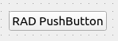

.. rst_epilog sometimes fails, so we need to include this explicitly, for colors
.. include:: <s5defs.txt>

.. _cpushbutton:

CPushButton
=====================

- `Description`_

  * `Supported data types`_
  * `Inheritance diagram`_

- `API reference`_

Description
-----------

:class:`~comrad.CPushButton` is a basic push-button to send a predefined value to the control system. There are 2 modes:

#. A fixed value can be given to the :attr:`~comrad.CPushButton.pressValue` property. Whenever the button is clicked,
   a signal containing this value will be sent to the connected channel. This is the default behavior of the button.
#. However, if the :attr:`~comrad.CPushButton.relativeChange` is set to ``True``, the fixed numeric value will be added
   to the current numeric value of the channel. This means that the button will increment a channel by a fixed amount
   with every click, a consistent relative move.

You can connect it to the control system by setting its :attr:`~comrad.CPushButton.channel` value to the address of your
device-property's field.

.. seealso:: :ref:`What is a channel? <basic/controls:Channels>`

Supported data types
^^^^^^^^^^^^^^^^^^^^

============  ============  ============  ============  ============  ============  ============  =========  =========  ==========  =========  =========  ==========  ===========  ===========  ============  ============  ============  ============  =============  =============  ==============
short         int           long          float         double        string        boolean       enum       enumSet    shortArray  intArray   longArray  floatArray  doubleArray  stringArray  booleanArray  intArray2D    longArray2D   floatArray2D  doubleArray2D  stringArray2D  booleanArray2D
------------  ------------  ------------  ------------  ------------  ------------  ------------  ---------  ---------  ----------  ---------  ---------  ----------  -----------  -----------  ------------  ------------  ------------  ------------  -------------  -------------  --------------
:green:`Yes`  :green:`Yes`  :green:`Yes`  :green:`Yes`  :green:`Yes`  :green:`Yes`  :green:`Yes`  :red:`No`  :red:`No`  :red:`No`   :red:`No`  :red:`No`  :red:`No`   :red:`No`    :red:`No`    :red:`No`     :red:`No`     :red:`No`     :red:`No`     :red:`No`      :red:`No`      :red:`No`
============  ============  ============  ============  ============  ============  ============  =========  =========  ==========  =========  =========  ==========  ===========  ===========  ============  ============  ============  ============  =============  =============  ==============

Inheritance diagram
^^^^^^^^^^^^^^^^^^^

.. inheritance-diagram:: comrad.CPushButton
    :parts: 1
    :top-classes: PyQt5.QtWidgets.QPushButton

API reference
-------------

.. autoclass:: comrad.CPushButton
    :members:
    :inherited-members: