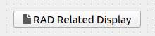

.. rst_epilog sometimes fails, so we need to include this explicitly, for colors
.. include:: <s5defs.txt>

.. _crelateddisplaybutton:

CRelatedDisplayButton
=====================

- `Description`_

  * `Supported data types`_
  * `Inheritance diagram`_

- `API reference`_

Description
-----------

:class:`~comrad.CRelatedDisplayButton` is a navigation button, which is not related to the control system. It can
either open a new ComRAD window with another dashboard (e. g. details screen of a particular device), or replace the
current window with a new dashboard. This behavior is toggled via :attr:`~comrad.CRelatedDisplayButton.openInNewWindow`
property.

Linked displays are read from :attr:`~comrad.CRelatedDisplayButton.filenames` property, where you list either Designer
(\*.ui) files or Python (\*.py) files. If names start with ``/`` symbol, they will be treated as an absolute path.
Otherwise, path will stay relative to the location of the file that contains the :class:`~comrad.CRelatedDisplayButton`
instance.

When more than one display is specified in :attr:`~comrad.CRelatedDisplayButton.filenames`, user will have to choose
where to navigate on click, via dropdown menu.

Right clicking on :class:`~comrad.CRelatedDisplayButton` allows to open a display in a new window, even if default
configuration is set for inline display replacement. In case of multiple related displays, user is also able to choose
which one to open in the new window.

You can parametrize linked displays via
:attr:`~comrad.CRelatedDisplayButton.macros` property.

.. seealso:: :doc:`What is macros? <../../basic/macros>`

Supported data types
^^^^^^^^^^^^^^^^^^^^

.. note:: This widget does not connect to the control system.

Inheritance diagram
^^^^^^^^^^^^^^^^^^^

.. inheritance-diagram:: comrad.CRelatedDisplayButton
    :parts: 1
    :top-classes: PyQt5.QtWidgets.QPushButton

API reference
-------------

.. autoclass:: comrad.CRelatedDisplayButton
    :members:
    :inherited-members: