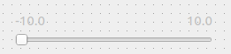

.. rst_epilog sometimes fails, so we need to include this explicitly, for colors
.. include:: <s5defs.txt>

.. _cslider:

CSlider
=====================

- `Description`_

  * `Supported data types`_
  * `Inheritance diagram`_

- `API reference`_

Description
-----------

:class:`~comrad.CSlider` allows adjusting a numeric value in the control system, given the possible range.

You can connect it to the control system by setting its :attr:`~comrad.CSlider.channel` value to the address of
your device-property's field.

.. seealso:: :ref:`What is a channel? <basic/controls:Channels>`

:class:`~comrad.CSlider` supports client-side data transformations via
:attr:`~comrad.CSlider.valueTransformation` that lets you modify displayed value with a piece of Python code.

.. seealso:: :doc:`What is client-side data transformations? <../../basic/transform>`

Supported data types
^^^^^^^^^^^^^^^^^^^^

============  ============  ============  ============  ============  =========  =========  =========  =========  ==========  =========  =========  ==========  ===========  ===========  ============  ==========  ===========  ============  =============  =============  ==============
short         int           long          float         double        string     boolean    enum       enumSet    shortArray  intArray   longArray  floatArray  doubleArray  stringArray  booleanArray  intArray2D  longArray2D  floatArray2D  doubleArray2D  stringArray2D  booleanArray2D
------------  ------------  ------------  ------------  ------------  ---------  ---------  ---------  ---------  ----------  ---------  ---------  ----------  -----------  -----------  ------------  ----------  -----------  ------------  -------------  -------------  --------------
:green:`Yes`  :green:`Yes`  :green:`Yes`  :green:`Yes`  :green:`Yes`  :red:`No`  :red:`No`  :red:`No`  :red:`No`  :red:`No`   :red:`No`  :red:`No`  :red:`No`   :red:`No`    :red:`No`    :red:`No`     :red:`No`   :red:`No`    :red:`No`     :red:`No`      :red:`No`      :red:`No`
============  ============  ============  ============  ============  =========  =========  =========  =========  ==========  =========  =========  ==========  ===========  ===========  ============  ==========  ===========  ============  =============  =============  ==============

Inheritance diagram
^^^^^^^^^^^^^^^^^^^

.. inheritance-diagram:: comrad.CSlider
    :parts: 1
    :top-classes: PyQt5.QtWidgets.QFrame

API reference
-------------

.. autoclass:: comrad.CSlider
    :members:
    :inherited-members: