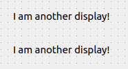

.. rst_epilog sometimes fails, so we need to include this explicitly, for colors
.. include:: <s5defs.txt>

.. _ctemplaterepeater:

CTemplateRepeater
=====================

- `Description`_

  * `Supported data types`_
  * `Inheritance diagram`_

- `API reference`_

Description
-----------

:class:`~comrad.CTemplateRepeater` renders another file in a grid, effectively duplicating template with ability to
parametrize each instance. A good example of application of this widget is displaying information about multiple
devices side by side. If you intend to have only one instance of the template, it is probably easier to use
:ref:`cembeddeddisplay`.

.. note:: Unlike :ref:`cembeddeddisplay`, :class:`~comrad.CTemplateRepeater` works only with Designer files (\*.ui)
          and currently cannot handle Python files (\*.py). `ACCPY-280 <https://issues.cern.ch/browse/ACCPY-280>`__.

It takes a template display (in :attr:`~comrad.CTemplateRepeater.templateFilename`) and a JSON-formatted file
(in :attr:`~comrad.CTemplateRepeater.dataSource`) that contains definition of the macros that should be parametrized for
each repeated inner display. Thus, you are driving the amount of displayed copies by altering JSON file.

.. note:: Inside ComRAD Designer this widget displays :attr:`~comrad.CTemplateRepeater.countShownInDesigner` amount of
          instances, rather than what it counts from the JSON file. This property has no effect in the runtime.

.. literalinclude:: ../../../_comrad_examples/1_basic/15_template_repeater/data.json
    :linenos:
    :caption: Example of the JSON data source file.

.. seealso:: :doc:`What is macros? <../../basic/macros>`

Whenever you specify file names, if the name starts with ``/`` symbol, it will be treated as an absolute path.
Otherwise, path will stay relative to the location of the file that contains the :class:`~comrad.CTemplateRepeater`
instance.

Supported data types
^^^^^^^^^^^^^^^^^^^^

.. note:: This widget does not connect to the control system.

Inheritance diagram
^^^^^^^^^^^^^^^^^^^

.. inheritance-diagram:: comrad.CTemplateRepeater
    :parts: 1
    :top-classes: PyQt5.QtWidgets.QFrame

API reference
-------------

.. autoclass:: comrad.CTemplateRepeater
    :members:
    :inherited-members:
