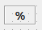

.. rst_epilog sometimes fails, so we need to include this explicitly, for colors
.. include:: <s5defs.txt>

.. _cvalueaggregator:

CValueAggregator
=====================

- `Description`_

  * `Supported data types`_
  * `Inheritance diagram`_

- `API reference`_

Description
-----------

:class:`~comrad.CValueAggregator`  is a special kind of widget that can be added to the dashboard (programmatically or
via ComRAD Designer) but is not visible at runtime. It can merge data from multiple channels to produce a single output.
Unlike most other widgets, it does not expose ``channel`` property but uses
:attr:`~comrad.CValueAggregator.inputChannels` to allow defining more than one.

.. seealso:: :ref:`What is a channel? <basic/controls:Channels>`

This widget does not display anything and rather defers presentation to other widgets, by exposing
:attr:`~comrad.CValueAggregator.updateTriggered` signal that you can connect other widgets to.

It does not require multiple channels and can be as well used with a single channel. The use-case for such application
is running a client-side data transformation on behalf of a widget that does not support it. For instance, you can
transform data and pass it over to :doc:`graphs/cscrollingplot`'s :meth:`~comrad.CScrollingPlot.pushData` slot to
display in a graph.

.. seealso:: :doc:`What is client-side data transformations? <../../basic/transform>`

:class:`~comrad.CValueAggregator` uses a slightly special client-side data transformation syntax than other widgets,
still accessible on :attr:`~comrad.CValueAggregator.valueTransformation` property. Unlike the linked page above, in this
widget you do not access ``new_val`` and ``header`` objects, but rather ``values`` and ``headers``.

.. include:: ../../shared/cvalueaggregator_example.rst

When used with multiple channels, you can define, when re-evaluation should be triggered, via
:attr:`~comrad.CValueAggregator.generatorTrigger` property. This can be either:

- *ANY*: Re-evaluate on every incoming value.
- *AGGREGATED_LAST*: Re-evaluate after all channels have sent a fresh value.
- *AGGREGATED_FIRST*: Re-evaluate if any channel has a fresh value, ignoring its subsequent values until all channels
  refresh. This is useful to introduce throttling when some channels have more frequent updates than others.

:class:`~comrad.CValueAggregator` can be (de-)activated by manipulating :meth:`~comrad.CValueAggregator.setActive` slot.

Supported data types
^^^^^^^^^^^^^^^^^^^^

============  ============  ============  ============  ============  ============  ============  ============  ============  ============  ============  ============  ============  ============  ============  ============  ============  ============  ============  =============  =============  ==============
short         int           long          float         double        string        boolean       enum          enumSet       shortArray    intArray      longArray     floatArray    doubleArray   stringArray   booleanArray  intArray2D    longArray2D   floatArray2D  doubleArray2D  stringArray2D  booleanArray2D
------------  ------------  ------------  ------------  ------------  ------------  ------------  ------------  ------------  ------------  ------------  ------------  ------------  ------------  ------------  ------------  ------------  ------------  ------------  -------------  -------------  --------------
:green:`Yes`  :green:`Yes`  :green:`Yes`  :green:`Yes`  :green:`Yes`  :green:`Yes`  :green:`Yes`  :green:`Yes`  :green:`Yes`  :green:`Yes`  :green:`Yes`  :green:`Yes`  :green:`Yes`  :green:`Yes`  :green:`Yes`  :green:`Yes`  :green:`Yes`  :green:`Yes`  :green:`Yes`  :green:`Yes`   :green:`Yes`   :green:`Yes`
============  ============  ============  ============  ============  ============  ============  ============  ============  ============  ============  ============  ============  ============  ============  ============  ============  ============  ============  =============  =============  ==============

Inheritance diagram
^^^^^^^^^^^^^^^^^^^

.. inheritance-diagram:: comrad.CValueAggregator
    :parts: 1
    :top-classes: PyQt5.QtWidgets.QWidget

API reference
-------------

.. autoclass:: comrad.CValueAggregator
    :members:
    :inherited-members: