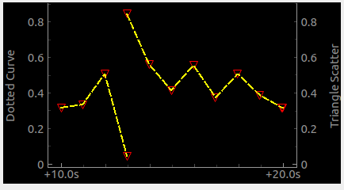

.. rst_epilog sometimes fails, so we need to include this explicitly, for colors
.. include:: <s5defs.txt>

.. _ccyclicplot:

CCyclicPlot
=====================

- `Description`_

  * `Supported data types`_
  * `Inheritance diagram`_

- `API reference`_

Description
-----------

:class:`~comrad.CCyclicPlot` is meant to scroll through the same cycle updating the previous display, similar to
how heart monitors do it. It is useful for displaying data in the context of a cycle of the injector / accelerator.

Data gets appended at first, until filling up the entire time frame. After it's full, data will be inserted from the
beginning.

.. seealso:: This widget builds on top of
             :class:`accwidgets.CyclicPlotWidget <accwidgets.graph.widgets.plotwidget.CyclicPlotWidget>`. Hence, it
             will have all the features of the parent library. For more details, see
             `accwidgets documentation <https://wikis.cern.ch/display/ACCPY/Graphs>`__.

.. include:: ./plot_channels.rst

In code, this would be achieved by calling :meth:`~comrad.CCyclicPlot.addCurve`,
:meth:`~comrad.CCyclicPlot.addBarGraph`, :meth:`~comrad.CCyclicPlot.addInjectionBar` or
:meth:`~comrad.CCyclicPlot.addTimestampMarker` APIs, where you pass channel address as ``data_source`` argument. You
can also use directly :meth:`~comrad.CCyclicPlot.add_channel_attached_item` and
:meth:`~comrad.CCyclicPlot.remove_channel_attached_item` for better control and more flexibility than higher-level APIs.

:class:`~comrad.CCyclicPlot` exposes :meth:`~comrad.CCyclicPlot.pushData` slot in order to accept and display local
data, that does not come from the control system (for example when used in conjunction with :ref:`cvalueaggregator`).
Because in this case you do not have a regular workflow to setup plotting items, styling properties have been exposed
directly on the widget and their names start with ``pushData...``,
e.g. :attr:`~comrad.CCyclicPlot.pushDataItemPenColor`, :attr:`~comrad.CCyclicPlot.pushDataItemSymbol`, etc.

.. include:: ./plot_layers.rst
In code, you can use API :meth:`~comrad.CCyclicPlot.add_layer`.

Supported data types
^^^^^^^^^^^^^^^^^^^^

.. include:: ./plot_data_types.rst

============  ============  ============  ============  ============  ============  =========  =========  =========  ==========  =========  =========  ==========  ===========  ===========  ============  ==========  ===========  ============  =============  =============  ==============
short         int           long          float         double        string        boolean    enum       enumSet    shortArray  intArray   longArray  floatArray  doubleArray  stringArray  booleanArray  intArray2D  longArray2D  floatArray2D  doubleArray2D  stringArray2D  booleanArray2D
------------  ------------  ------------  ------------  ------------  ------------  ---------  ---------  ---------  ----------  ---------  ---------  ----------  -----------  -----------  ------------  ----------  -----------  ------------  -------------  -------------  --------------
:green:`Yes`  :green:`Yes`  :green:`Yes`  :green:`Yes`  :green:`Yes`  :green:`Yes`  :red:`No`  :red:`No`  :red:`No`  :red:`No`   :red:`No`  :red:`No`  :red:`No`   :red:`No`    :red:`No`    :red:`No`     :red:`No`   :red:`No`    :red:`No`     :red:`No`      :red:`No`      :red:`No`
============  ============  ============  ============  ============  ============  =========  =========  =========  ==========  =========  =========  ==========  ===========  ===========  ============  ==========  ===========  ============  =============  =============  ==============

Inheritance diagram
^^^^^^^^^^^^^^^^^^^

.. inheritance-diagram:: comrad.CCyclicPlot
    :parts: 1
    :top-classes: pyqtgraph.widgets.PlotWidget.PlotWidget

API reference
-------------

.. autoclass:: comrad.CCyclicPlot
    :members:
    :inherited-members:
