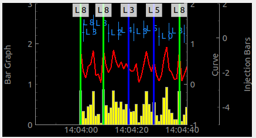

.. rst_epilog sometimes fails, so we need to include this explicitly, for colors
.. include:: <s5defs.txt>

.. _cscrollingplot:

CScrollingPlot
=====================

- `Description`_

  * `Supported data types`_
  * `Inheritance diagram`_

- `API reference`_

Description
-----------

:class:`~comrad.CScrollingPlot` displays live data that is arriving from the control system in real time. This data
can be represented in multiple ways, e.g. as lines, bar graph, injection marks, etc. Data can either contain a
timestamp to be precise about timing, or such timestamp will be created whenever the widget receives the data. It
appends data on one side, thus scrolling the view port through time series.

.. seealso:: This widget builds on top of
             :class:`accwidgets.ScrollingPlotWidget <accwidgets.graph.widgets.plotwidget.ScrollingPlotWidget>`.
             Hence, it will have all the features of the parent library. For more details, see
             `accwidgets documentation <https://wikis.cern.ch/display/ACCPY/Graphs>`__.

.. include:: ./plot_channels.rst

In code, this would be achieved by calling :meth:`~comrad.CScrollingPlot.addCurve`,
:meth:`~comrad.CScrollingPlot.addBarGraph`, :meth:`~comrad.CScrollingPlot.addInjectionBar` or
:meth:`~comrad.CScrollingPlot.addTimestampMarker` APIs, where you pass channel address as ``data_source`` argument. You
can also use directly :meth:`~comrad.CScrollingPlot.add_channel_attached_item` and
:meth:`~comrad.CScrollingPlot.remove_channel_attached_item` for better control and more flexibility than higher-level APIs.

:class:`~comrad.CScrollingPlot` exposes :meth:`~comrad.CScrollingPlot.pushData` slot in order to accept and display local
data, that does not come from the control system (for example when used in conjunction with :ref:`cvalueaggregator`).
Because in this case you do not have a regular workflow to setup plotting items, styling properties have been exposed
directly on the widget and their names start with ``pushData...``,
e.g. :attr:`~comrad.CScrollingPlot.pushDataItemPenColor`, :attr:`~comrad.CScrollingPlot.pushDataItemSymbol`, etc.

.. include:: ./plot_layers.rst
In code, you can use API :meth:`~comrad.CScrollingPlot.add_layer`.

Supported data types
^^^^^^^^^^^^^^^^^^^^

.. include:: ./plot_data_types.rst

============  ============  ============  ============  ============  ============  =========  =========  =========  ==========  =========  =========  ==========  ===========  ===========  ============  ==========  ===========  ============  =============  =============  ==============
short         int           long          float         double        string        boolean    enum       enumSet    shortArray  intArray   longArray  floatArray  doubleArray  stringArray  booleanArray  intArray2D  longArray2D  floatArray2D  doubleArray2D  stringArray2D  booleanArray2D
------------  ------------  ------------  ------------  ------------  ------------  ---------  ---------  ---------  ----------  ---------  ---------  ----------  -----------  -----------  ------------  ----------  -----------  ------------  -------------  -------------  --------------
:green:`Yes`  :green:`Yes`  :green:`Yes`  :green:`Yes`  :green:`Yes`  :green:`Yes`  :red:`No`  :red:`No`  :red:`No`  :red:`No`   :red:`No`  :red:`No`  :red:`No`   :red:`No`    :red:`No`    :red:`No`     :red:`No`   :red:`No`    :red:`No`     :red:`No`      :red:`No`      :red:`No`
============  ============  ============  ============  ============  ============  =========  =========  =========  ==========  =========  =========  ==========  ===========  ===========  ============  ==========  ===========  ============  =============  =============  ==============

Inheritance diagram
^^^^^^^^^^^^^^^^^^^

.. inheritance-diagram:: comrad.CScrollingPlot
    :parts: 1
    :top-classes: pyqtgraph.widgets.PlotWidget.PlotWidget

API reference
-------------

.. autoclass:: comrad.CScrollingPlot
    :members:
    :inherited-members:
