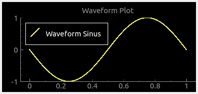

.. rst_epilog sometimes fails, so we need to include this explicitly, for colors
.. include:: <s5defs.txt>

.. _cstaticplot:

CStaticPlot
=====================

- `Description`_

  * `Supported data types`_
  * `Inheritance diagram`_

- `API reference`_

Description
-----------

:class:`~comrad.CStaticPlot` is not moving with time and allows replacing the entire contents of the graph, rather
than appending points to the existing data set. This makes it perfect for displaying waveforms, frequencies, or
simply graphs that are recalculated on every tick.

.. seealso:: This widget builds on top of
             :class:`accwidgets.StaticPlotWidget <accwidgets.graph.widgets.plotwidget.StaticPlotWidget>`. Hence, it
             will have all the features of the parent library. For more details, see
             `accwidgets documentation <https://wikis.cern.ch/display/ACCPY/Graphs>`__.

.. include:: ./plot_channels.rst

In code, this would be achieved by calling :meth:`~comrad.CStaticPlot.addCurve`,
:meth:`~comrad.CStaticPlot.addBarGraph`, :meth:`~comrad.CStaticPlot.addInjectionBar` or
:meth:`~comrad.CStaticPlot.addTimestampMarker` APIs, where you pass channel address as ``data_source`` argument. You
can also use directly :meth:`~comrad.CStaticPlot.add_channel_attached_item` and
:meth:`~comrad.CStaticPlot.remove_channel_attached_item` for better control and more flexibility than higher-level APIs.

:class:`~comrad.CStaticPlot` exposes several slots in order to accept and display local data that does not come from
the control system (for example when used in conjunction with :ref:`cvalueaggregator`). These slots are
:meth:`~comrad.CStaticPlot.replaceDataAsCurve`, :meth:`~comrad.CStaticPlot.replaceDataAsBarGraph` and
:meth:`~comrad.CStaticPlot.replaceDataAsInjectionBars`. Because in this case you do not have a regular workflow to
setup plotting items, styling properties have been exposed directly on the widget and their names start with
``replaceData...``, e.g. :attr:`~comrad.CStaticPlot.replaceDataItemPenColor`,
:attr:`~comrad.CStaticPlot.replaceDataItemSymbol`, etc.

.. include:: ./plot_layers.rst
In code, you can use API :meth:`~comrad.CStaticPlot.add_layer`.

Supported data types
^^^^^^^^^^^^^^^^^^^^

.. include:: ./plot_data_types.rst

=========  =========  =========  =========  =========  =========  =========  =========  =========  ============  ============  ============  ============  ============  ============  ============  ============  ============  ============  =============  =============  ==============
short      int        long       float      double     string     boolean    enum       enumSet    shortArray    intArray      longArray     floatArray    doubleArray   stringArray   booleanArray  intArray2D    longArray2D   floatArray2D  doubleArray2D  stringArray2D  booleanArray2D
---------  ---------  ---------  ---------  ---------  ---------  ---------  ---------  ---------  ------------  ------------  ------------  ------------  ------------  ------------  ------------  ------------  ------------  ------------  -------------  -------------  --------------
:red:`No`  :red:`No`  :red:`No`  :red:`No`  :red:`No`  :red:`No`  :red:`No`  :red:`No`  :red:`No`  :green:`Yes`  :green:`Yes`  :green:`Yes`  :green:`Yes`  :green:`Yes`  :green:`Yes`  :red:`No`     :red:`No`     :red:`No`     :red:`No`     :red:`No`      :red:`No`      :red:`No`
=========  =========  =========  =========  =========  =========  =========  =========  =========  ============  ============  ============  ============  ============  ============  ============  ============  ============  ============  =============  =============  ==============

Inheritance diagram
^^^^^^^^^^^^^^^^^^^

.. inheritance-diagram:: comrad.CStaticPlot
    :parts: 1
    :top-classes: pyqtgraph.widgets.PlotWidget.PlotWidget

API reference
-------------

.. autoclass:: comrad.CStaticPlot
    :members:
    :inherited-members:
