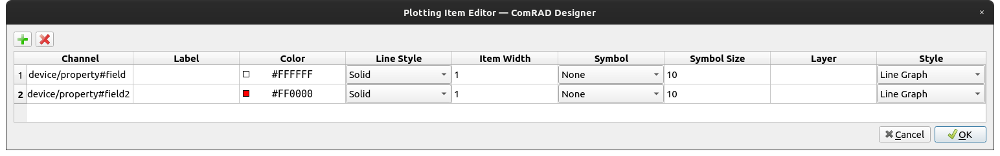

Unlike in most other widgets, graphs do not have a single ``channel`` property. Instead, you can define channels one
per data set.

.. seealso:: :ref:`What is a channel? <basic/controls:Channels>`

For this, in ComRAD Designer, right-click on the widget and choose "Edit Plotting Items..." menu.

   Plotting Item editor in ComRAD Designer