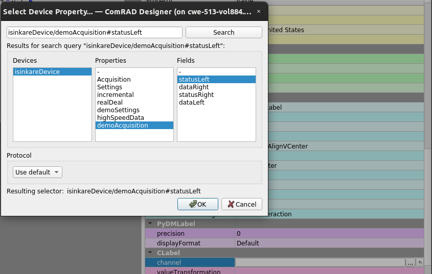
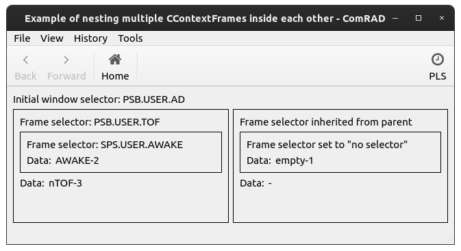

Control system
==============

Bridging UI components with the control system is the main goal of ComRAD as a RAD tool. There are 2 main concepts
related to the control system that exist in ComRAD: `Channels`_ and `Contexts`_. The former one allows addressing a
device inside the control system, while the later one augments this communication with extra information.

- `Channels`_

  * `Meta fields`_

- `Contexts`_

  * `Cycle selectors`_
  * `Data filters`_

- `Connecting widgets`_

  * `Using ComRAD Designer`_
  * `Altering application-wide cycle selector`_
  * `Specializing connection using contexts and CContextFrame`_

- `Alternative channel formats`_

Channels
--------

Channels (name originally comes from EPICS control system) are the bridge between UI widgets and communication
handlers, called :doc:`Data Plugins <../advanced/dataplugins>`. Data plugins are mostly used as a control
system access point, but it also could interface a local data storage or an archived database. Each
control-system-aware widget is associated with one or more channels. Channels are specified in the following format:

.. code-block::

   [<protocol>://]<channel address>

Where ``<protocol>`` is an optional unique identifier for a given Data Plugin and ``<channel address>`` varies from
plugin to plugin. Omitting the protocol will call the default Data Plugin.

Currently, ComRAD supports 5 protocols: ``rda3://``, ``rda://``, ``tgm://``, ``rmi://``, ``no://``. All of them are
piped through the same `PyJAPC <https://acc-py.web.cern.ch/gitlab/scripting-tools/pyjapc/docs/stable/>`__ plugin.
Omitting the protocol, will call the same implementation. Therefore ``<channel address>`` format remains the same and
follows CERN device-property model notation, making the following cases possible:

.. code-block::
   :linenos:

   device/property
   device/property#field
   protocol:///device/property
   protocol:///device/property#field
   protocol://service/device/property
   protocol://service/device/property#field

Meta fields
^^^^^^^^^^^

Sometimes there is a need to access meta information about the data sample, such as acquisition timestamp of the
played user. This information is separated from the data in the control system, however ComRAD allows
accessing it in the similar fashion as regular fields, by detecting the special case, and extracting information from
the message header instead of its body.

.. note:: To access meta information as regular data fields, they should be registered and discoverable in CCDB
          alongside normal fields.

The following names are reserved and using them will assume the access to the meta-field:

- ``acqStamp``
- ``setStamp``
- ``cycleStamp``
- ``cycleName``

So, for example, accessing the address ``myDevice/myProperty#cycleName`` will trigger meta-field resolution.

.. note:: The above list corresponds to the "special" fields in FESA, with one little difference - it's missing
          ``updateFlags``. This field is a very low-level combination of bits that is not intended to be visible
          to the control system users, and therefore is not supported.

Contexts
--------

Contexts are entities that augment information to each connection being made. Currently, contexts provide 2 additional
pieces of information:

- `Cycle selector <Cycle selectors>`_
- `Data filters`_

There's at least one context that exists in the running application. It is controlled by the main window. Thus, when
you change a :ref:`PLS selector in the main window <basic/controls:Altering application-wide cycle selector>`, it will
update all connections in that window. During the connection, widgets request context information. Updating a property
of their context will result in termination of the previous connection and creation of the new one.

You can also :ref:`add an additional context <basic/controls:Specializing connection using contexts and CContextFrame>`,
in which case it may override a certain property, or may choose to inherit it. Multiple contexts are arranged in the
parent-child relationship tree, with window context always being the root, where children can choose to inherit or
override the individual properties of the parent context.

.. graphviz::
   :align: center
   :caption: Example of the application with multiple contexts
   :alt: Example of the application with multiple contexts

   digraph {
     node [shape=box style=filled];
     window [label=<<b>Window context</b> selector: SPS.USER.ALL>]
     ctx1 [label=<<b>Context 1</b> selector: SPS.USER.MD1>]
     ctx2 [label=<<b>Context 2</b> selector: SPS.USER.MD2>]
     ctx3 [label=<<b>Context 3</b> selector: inherited>]
     w0 [label=<<b>Widget 0</b> using: SPS.USER.ALL> fillcolor=bisque]
     w1 [label=<<b>Widget 1</b> using: SPS.USER.MD1> fillcolor=bisque]
     w3 [label=<<b>Widget 3</b> using: SPS.USER.MD2> fillcolor=bisque]
     window -> w0;
     window -> ctx1;
     window -> ctx2;
     ctx1 -> w1;
     ctx2 -> ctx3;
     ctx3 -> w3;
   }

Cycle selectors
^^^^^^^^^^^^^^^

Cycle selectors allow receiving the information relevant to a concrete playing cycle. Across wikis, you can
additionally find terms *timing user*, *PLS selector* or sometimes just *selector*, but they all refer to the
same thing. Selectors consist of 3 components delimited by dots, e.g.

.. code-block::

   LHC.USER.ALL

While cycle selector could be applied to a concrete property or field, more often a single cycle selector is being
used for the entire application. That's why it is not being part of the channel address, but rather a global variable
that is applied through the context. Parts of the application can work with a different cycle selector, by attaching
to another context that overrides the selector value.

Data filters
^^^^^^^^^^^^

Data filters is a low-level feature oriented on equipment experts working directly with FESA classes. In a way,
it's a more flexible version of selector, where defined filter does not necessarily correspond to the played cycle
but any arbitrary property encoded in the FESA class. ComRAD data filters allow specifying more than one value,
by accepting a key-value dictionary, e.g.

.. code-block:: python

   {
       'fesa-prop-1': 'value1',
       'fesa-prop-2': 'value2',
   }

.. note:: Using data filters will make ComRAD ignore any cycle selectors for the same connection.

Connecting widgets
------------------

Most of the control-system enabled widgets have a property called ``channel`` (or similar in exceptional cases).
In order for a widget to display data (or send data) to a concrete device field, you assign a string address
of that field, e.g.:

.. code-block:: python

   my_widget.channel = 'myDevice/myProperty#myField'

When multiple widgets connect to the same address, only a single connection is created but it is serving multiple
widgets. To view known connections in the running application, open menu "View"->"Show connections...".

   Connections Dialog

Using ComRAD Designer
^^^^^^^^^^^^^^^^^^^^^

To connect a widget in ComRAD Designer, locate the property with the same name in the "Property Editor". There,
you can either enter a string value into the field, or click "..." button to open a Device Property dialog,
that allows you to discover devices and their structure. In the same dialog, you can select the protocol and
optionally assign a cycle selector.

   Device Property Dialog

Altering application-wide cycle selector
^^^^^^^^^^^^^^^^^^^^^^^^^^^^^^^^^^^^^^^^

To alter the window's cycle selector, click "PLS" button in the main toolbar to open the dialog.
It you cannot locate the button, it could have been hidden by overriding the toolbar's contents: refer to
:doc:`../advanced/plugins`.

   Cycle Selector Dialog

Specializing connection using contexts and CContextFrame
^^^^^^^^^^^^^^^^^^^^^^^^^^^^^^^^^^^^^^^^^^^^^^^^^^^^^^^^

In order to establish context chain, as explained in `Contexts`_, widget could be organized in groups
by placing them inside :ref:`CContextFrame <ccontextframe>` widget. In code, you'll be able to manipulate
all context properties by assigning them to the widget and also establish inheritance flags. In Designer,
you can specify the modified cycle selector directly via "Property Editor". To showcase
:ref:`CContextFrame <ccontextframe>` in action, we invite you to see ComRAD Example "Nested context frames".

   Screenshot of "Nested context frames" example

In adition to ability define context properties upfront, :ref:`CContextFrame <ccontextframe>` exposes slots
that can be connected in order to dynamically change the properties. For example, you can create a combobox,
that allows choosing one of the selectors, and use it to drive the frame context parameters.

Alternative channel formats
---------------------------

While ComRAD ships with only PyJAPC plugin at the moment, the architecture allows arbitrary amount of
Data Plugins to handle various communication types, such as HTTP, RDB, etc. This is enabled by the
architecture of PyDM, the underlying framework of ComRAD.
`More information <https://slaclab.github.io/pydm-tutorial/intro/data_arch.html>`__.

.. figure:: https://slaclab.github.io/pydm-tutorial/_images/architecture.png
   :align: center
   :alt: Data flux architecture

   Data flux architecture

It is possible to create your own Data Plugin, as long as it is assigned to a protocol that is not yet
reserved. To discover how to write your own Data Plugin, have a look at
:doc:`../advanced/dataplugins`.
