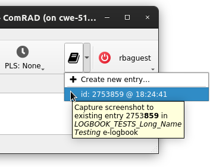

Logbook integration
===================

Logbook integration is provided in the shape of a toolbar plugin that provides a button to take the screenshot of the
ComRAD application window and upload it to the e-logbook alongside the text message that will be prompted from the
user when the screenshot is taken. This is enabled by accwidgets'
:class:`~accwidgets.screenshot.ScreenshotButton`.

   Example of logbook integration in ComRAD application window

This functionality is likely to interest operational users only, therefore it's disabled by default. However,
enabling it takes just a few extra launch arguments:

.. code-block:: bash

   comrad run \
     --enable-plugins comrad.screenshot \
     --window-plugin-config comrad.screenshot.activities=LINAC_4 \
     -- \
     app.ui

.. seealso:: These are the arguments used by :doc:`../advanced/plugins` machinery.

As visible above, "activities" definition is important to provide, because it indicates into which e-logbook the
entry will be uploaded.

Optionally, user may supply additional configuration, such as:

* ``comrad.screenshot.decor=1`` to include window decorations (frame and title bar) in the screenshots
* ``comrad.screenshot.server=<server name>`` to upload to an alternative server. Currently supported values are ``PRO``
  and ``TEST``.

For instance:

.. code-block:: bash

   comrad run \
     --enable-plugins comrad.screenshot \
     --window-plugin-config \
         comrad.screenshot.activities=LINAC_4 \
         comrad.screenshot.decor=1 \
     -- \
     app.ui

The interaction with e-logbook requires a valid RBAC token, therefore the button is disabled until the user
authenticates.

.. seealso:: You can try it out in :ref:`intro:Interactive examples` by running the example in "Window plugins"
             category → "Screenshot Plugin".
