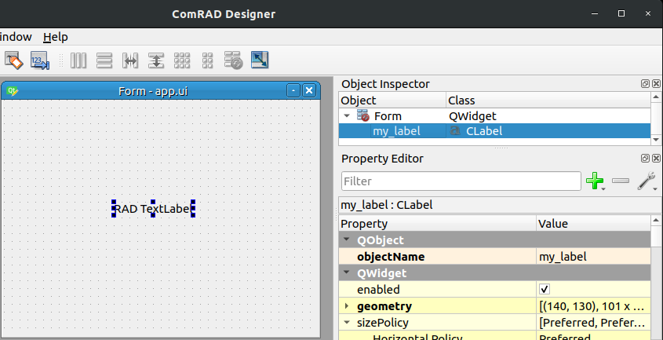

Mixing ComRAD Designer with code
================================

In :doc:`../intro`, you've learned how to prepare a simple application (\*.ui) file with
ComRAD Designer. This file can be launched using the following command:

.. code-block:: bash

   comrad run /path/to/my/app.ui

However, if you want to go beyond basic capabilities of Designer, you can do so by mixing some logic
written in Python and modifying your UIs from code.

- `Subclass CDisplay`_
- `Create ComRAD Designer file`_
- `Add custom logic in code`_
- `Generating UI code`_

Subclass CDisplay
-----------------

To start with introducing code to your ComRAD application, you have to create a Python file with a
:ref:`cdisplay` subclass. :class:`~comrad.CDisplay` is a :class:`QWidget` that will accommodate all
of your application UI. Let's call this file ``app.py``:

.. topic:: Example of ComRAD Python file, app.py

   .. code-block:: python
      :linenos:

      from comrad import CDisplay

      class MyDisplay(CDisplay):

      def ui_filename(self):
          return 'app.ui'

The above example does nothing more than declaring a subclass, and pointing that UI should be generated
from the Designer file, ``app.ui``. The file location will be resolved relative to the location of the Python
file, ``app.py``. Hence, you can return a ``subdir/app.ui`` instead and place the \*.ui file in the sub-directory
accordingly.

Create ComRAD Designer file
---------------------------

Now, all widgets added in the Designer file, will appear as instance attributes inside the ``MyDisplay`` class.
We can reference them in order to inject custom logic. For starters, let's assume our ``app.ui`` defines a
:class:`~comrad.CLabel` that has name ``my_label`` in ComRAD Designer's Object Inspector.

   app.ui in ComRAD Designer

Notice the name ``my_label`` in the Object Inspector. In code, we will have the variable with the same
name, i.e. will be able to access the label from ``MyDisplay`` by querying ``self.my_label``.

Add custom logic in code
------------------------

Let's go ahead and assign a channel to this label during initialization:

.. code-block:: python
   :linenos:

   ...

   class MyDisplay(CDisplay):

       def __init__(self, *args, **kwargs):
           super().__init__(*args, **kwargs)

           # Assign custom channel
           self.my_label.channel = 'myDevice/myProperty#myField'

       ...

Given that our device-property address points to an existing instance, we can run it with the command
below to see the label displaying real values.

.. code-block:: bash

   comrad run /path/to/my/app.py

.. topic:: Remember

   .. note:: You will have to run it in TN, or otherwise opt out from using InCA
             (pass ``--no-inca`` command line argument).

You can learn more about developing :ref:`cdisplay` subclasses in :doc:`codecentric`.

Generating UI code
------------------

You may decide that keeping widgets in the code is better for some reason, e.g. having better IDE support
with auto-completion. However, every line of code brings maintenance cost. When the UI gets complicated,
You may consider designing the UI in ComRAD Designer and then generating the code out of the \*.ui file.
`pyuic5 <https://likegeeks.com/pyqt5-tutorial/#Converting-the-ui-file-to-a-py-file-using-pyuic5>`__
is a standard PyQt5 tool and does exactly that.

.. code-block:: bash

   pyuic5 app.ui -o generated.py

Will generate a code for you. For instance, for the above example with a single label, the generated
output should be similar to:

.. topic:: pyuic5 output

   .. code-block:: python
      :linenos:

      # -*- coding: utf-8 -*-

      # Form implementation generated from reading ui file 'app.ui'
      #
      # Created by: PyQt5 UI code generator 5.12.1
      #
      # WARNING! All changes made in this file will be lost!

      from PyQt5 import QtCore, QtGui, QtWidgets

      class Ui_Form(object):
          def setupUi(self, Form):
              Form.setObjectName("Form")
              Form.resize(400, 300)
              self.my_label = CLabel(Form)
              self.my_label.setGeometry(QtCore.QRect(140, 130, 101, 17))
              self.my_label.setObjectName("my_label")

              self.retranslateUi(Form)
              QtCore.QMetaObject.connectSlotsByName(Form)

          def retranslateUi(self, Form):
              _translate = QtCore.QCoreApplication.translate
              Form.setWindowTitle(_translate("Form", "Form"))

      from comrad.widgets.indicators import CLabel

Now you simply need to include the generated file into your :class:`~comrad.CDisplay` subclass to get hands on the UI
objects.

.. topic:: Inherit generated code in app.py

   .. code-block:: python
      :linenos:

      from comrad import CDisplay
      from generated import Ui_Form

      class MyDisplay(CDisplay, Ui_Form):

      def __init__(self, *args, **kwargs):
          super().__init__(*args, **kwargs)
          self.setupUi(self)  # Actually create widgets

          # Assign custom channel
          self.my_label.channel = 'myDevice/myProperty#myField'

You notice that we are using multiple inheritance now, where ``MyDisplay`` is a subclass of both
:class:`~comrad.CDisplay` and ``Ui_Form``. While, making our code look nice (with direct access to ``self.my_label``)
multiple inheritance can get complicated and bring problems in complex projects. Alternatively, you may
choose the path of composition, where your UI objects are scoped inside another attribute, say ``self.ui``.

.. topic:: Include generated code using composition in app.py

   .. code-block:: python
      :linenos:

      from comrad import CDisplay
      from generated import Ui_Form

      class MyDisplay(CDisplay):

      def __init__(self, *args, **kwargs):
          super().__init__(*args, **kwargs)
          self.ui = Ui_Form()
          self.ui.setupUi(self)

          # Assign custom channel
          self.ui.my_label.channel = 'myDevice/myProperty#myField'

Notice, that now we have to access ``self.ui.my_label`` instead of ``self.my_label``.
