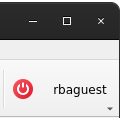

RBAC integration
================

ComRAD integrates with RBAC similar to Java applications, with reduced capabilities. By default, ComRAD works with
the production RBAC service. If you are will to switch to an alternative server, refer to :doc:`../advanced/cmw`.

- `Authentication`_

  * `Authentication during startup`_
  * `Authentication in UI`_

- `Authorization`_
- `RBAC Token`_

Authentication
--------------

Currently we support the following means of authentication:

- By location
- With username and password

.. note:: Kerberos authentication is not supported yet. Out current plan is to implement it when PyRBAC library
          gets released.

Authentication during startup
^^^^^^^^^^^^^^^^^^^^^^^^^^^^^

During the startup, a ComRAD application will try to authenticate by location. In case of success, user will be
logged in by the time UI renders. In case of failure, user will remain not authenticated.

.. todo:: Authentication by location on startup is the default behavior currently and can't be changed. We can make
          it configurable in the future, if there's a demand for it.

Authentication in UI
^^^^^^^^^^^^^^^^^^^^

User authentication status gets reflected by the navigation bar item:

=========================  ======================
**User is authenticated**  **User is logged out**
-------------------------  ----------------------
|loggedin|                 |loggedout|
=========================  ======================

.. |loggedout| image:: ../img/rbac_loggedout.png

The above navigation item uses :doc:`ComRAD window plugin system <../advanced/plugins>` and can be disabled in cases,
when RBAC login is not important for the workflow. To achieve this, add a command line argument ``--disable-plugins``,
e.g.

.. code-block:: bash

   comrad run --disable-plugins comrad.rbac my_app.ui

.. note:: In the future, we may consider embedding this information into the application file, so that certain
          applications will hide the bar item by default.

Authorization
-------------

Any authorization error produced by the control system will get logged in the command line output of the ComRAD
application. In addition, the errors produced on SET operation (which applies to both sending a value to the device
property, or issuing a command) will produce a popup window.

.. figure:: ../img/rbac_error.png
   :align: center
   :alt: Example of the error popup during SET operation

   Example of the error popup during SET operation

RBAC Token
----------

Unlike Java applications, ComRAD currently does not provide the detailed information about the user and the token.
This will change when PyRBAC library is released and integrated into ComRAD.
