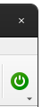

RBAC integration
================

ComRAD integrates with RBAC for device access. By default, ComRAD works with
the production RBAC service. If you are willing to switch to an alternative server, refer to :doc:`../advanced/cmw`.

- `Authentication`_

  * `Authentication during startup`_
  * `Authentication in UI`_

- `Authorization`_

  * `User roles`_

- `RBAC Token`_
- `Application name`_

Authentication
--------------

Currently we support the following means of authentication:

- By location
- With username and password

.. note:: Kerberos is not supported, as it is not available in :mod:`pyrbac`.

Authentication during startup
^^^^^^^^^^^^^^^^^^^^^^^^^^^^^

During the startup, a ComRAD application will try to authenticate by location. In case of success, user will be
logged in by the time UI renders. In case of failure, user will remain not authenticated.

It is possible to alter login during startup by defining ``COMRAD_STARTUP_LOGIN_POLICY`` environment variable. Accepted
values are:

* ``LOGIN_BY_LOCATION``: Attempt to login by location. This is default behavior.
* ``NO_LOGIN``: Do not attempt any login at launch.

If ``--rbac-token`` command line argument was supplied during launch, this token will be parsed and used instead of
default location login policy. This command line argument is also propagated into subprocesses (e.g. when opening
new windows using :class:`~comrad.CRelatedDisplayButton`, so that authentication is preserved).

Authentication in UI
^^^^^^^^^^^^^^^^^^^^

User authentication status gets reflected by the navigation bar item:

=========================  ======================
**User is authenticated**  **User is logged out**
-------------------------  ----------------------
|loggedin|                 |loggedout|
=========================  ======================

.. |loggedin| image:: ../img/rbac_loggedin.png

The above navigation item uses :doc:`ComRAD window plugin system <../advanced/plugins>` and can be disabled in cases,
when RBAC login is not important for the workflow. To achieve this, add a command line argument ``--disable-plugins``,
e.g.

.. code-block:: bash

   comrad run \
     --disable-plugins comrad.rbac \
     /path/to/my/app.ui

When authenticating, by default all available non-critical (non-MCS) roles will be assigned to the user. You can opt-in
to alter the roles during login, or change it afterwards via a dialog, as explained in `User roles`_. To alter roles
at login, tick the checkbox "Select roles at login".

.. figure:: ../img/login_dialog.png
   :align: center
   :alt: Example of the login popup offering role selection

   Example of the login popup offering role selection

It will interactively ask to select roles using the dialog similar to :ref:`role_picker` before
finishing the authentication sequence.

.. note:: By default, tokens are automatically renewed before they expire. However, when selecting specific roles,
          auto-renewal feature is disabled. This also applies to cases when initially auto-renewable token was received,
          but then another token was generated by selecting roles, as explained in `User roles`_.

Authorization
-------------

Authorization refers to permissions for certain actions of an authenticated user. Normally, RBAC permissions for
concrete actions are configured on the FESA/LSA side. User may configure roles that will present a different set
of permissions within a scope of given authenticated session.

Any authorization error produced by the control system will get logged in the command line output of the ComRAD
application. In addition, the errors produced on SET operation (which applies to both sending a value to the device
property, or issuing a command) will produce a popup window.

.. figure:: ../img/rbac_error.png
   :align: center
   :alt: Example of the error popup during SET operation

   Example of the error popup during SET operation

User roles
^^^^^^^^^^

During authentication, user receives a default set of non-critical roles. These can be changed by clicking on the
username in the navigation bar, and selecting menu "Select Roles".

Presented dialog displays all available roles, including critical roles
(`MCS - "Management of Critical Settings" <https://wikis.cern.ch/display/LSA/MCS>`__) that are colored in red.

.. _role_picker:

   Example of the RBAC role picker dialog

Changing roles will require to authenticate again in order to receive a new RBAC token with selected roles. In case of
initial login by location, token will be renewed automatically by issuing another request by location. If user has
initially authenticated with username and password, password confirmation will be required in the pop-up dialog.

.. figure:: ../img/role_picker_auth.png
   :align: center
   :alt: Example of password confirmation after changing RBAC roles

   Example of password confirmation after changing RBAC roles

RBAC Token
----------

RBAC token can be reviewed for an authenticated user by clicking on the username in the navigation bar, and selecting
menu "Show Existing RBAC Token".

It presents all relevant information similarly to Java applications, omitting some parts that are specific to Java APIs,
e.g. "Context".

.. _token_dialog:

.. figure:: ../img/token_info.png
   :align: center
   :alt: Example of the Token details dialog

   Example of the Token details dialog

.. figure:: ../img/token_info_invalid.png
   :align: center
   :alt: Example of the expired Token details

   Example of the expired Token details

Application name
----------------

When contacting RBAC servers, the library provides the information about the client. By default, :mod:`pyrbac` will
set the application name to executable name, e.g. ``comrad``. This can be changed by defining ``RBAC_APPLICATION_NAME``
variable. The application name is reflected in the authenticated token and can be found in
:ref:`token details dialog <token_dialog>`.
