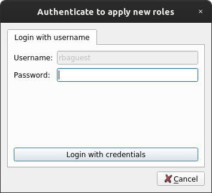

RBAC integration
================

ComRAD integrates with RBAC similar to Java applications, with reduced capabilities. By default, ComRAD works with
the production RBAC service. If you are willing to switch to an alternative server, refer to :doc:`../advanced/cmw`.

- `Authentication`_

  * `Authentication during startup`_
  * `Authentication in UI`_

- `Authorization`_

  * `User roles`_

- `RBAC Token`_
- `Public key`_

.. note:: Current RBAC implementation in ComRAD is a mix between C++-based PyRBAC and Java-based RBAC libraries. The
          intention is to gradually migrate functionality from Java to C++, but this transition period may impose
          limitations.

Authentication
--------------

Currently we support the following means of authentication:

- By location
- With username and password

.. note:: Kerberos authentication is not supported yet. It will be added when PyRBAC library
          receives Kerberos support.

Authentication during startup
^^^^^^^^^^^^^^^^^^^^^^^^^^^^^

During the startup, a ComRAD application will try to authenticate by location. In case of success, user will be
logged in by the time UI renders. In case of failure, user will remain not authenticated.

.. todo:: Authentication by location on startup is the default behavior currently and can't be changed. We can make
          it configurable in the future, if there's a demand for it.

Authentication in UI
^^^^^^^^^^^^^^^^^^^^

User authentication status gets reflected by the navigation bar item:

=========================  ======================
**User is authenticated**  **User is logged out**
-------------------------  ----------------------
|loggedin|                 |loggedout|
=========================  ======================

.. |loggedin| image:: ../img/rbac_loggedin.png
.. |loggedout| image:: ../img/rbac_loggedout.png

The above navigation item uses :doc:`ComRAD window plugin system <../advanced/plugins>` and can be disabled in cases,
when RBAC login is not important for the workflow. To achieve this, add a command line argument ``--disable-plugins``,
e.g.

.. code-block:: bash

   comrad run \
     --disable-plugins comrad.rbac \
     /path/to/my/app.ui

.. note:: In the future, we may consider embedding this information into the application file, so that certain
          applications will hide the bar item by default.

When authenticating, by default all available non-critical (non-MCS) roles will be assigned to the user. You can opt-in
to alter the roles during login, or change it afterwards via a dialog, as explained in `User roles`_. To alter roles
at login, tick the checkbox "Select roles at login".

.. figure:: ../img/login_dialog.png
   :align: center
   :alt: Example of the login popup offering role selection

   Example of the login popup offering role selection

It will interactively ask to select roles using the dialog similar to :ref:`role_picker` before
finishing the authentication sequence.

Authorization
-------------

Any authorization error produced by the control system will get logged in the command line output of the ComRAD
application. In addition, the errors produced on SET operation (which applies to both sending a value to the device
property, or issuing a command) will produce a popup window.

   Example of the error popup during SET operation

User roles
^^^^^^^^^^

During authentication, user receives a default set of non-critical roles. These can be changed by clicking on the
username in the navigation bar, and selecting menu "Select Roles".

.. note:: This functionality is unavailable after automatic authentication on startup and needs manual
          login by the user.

Presented dialog displays all available roles, including critical roles
(`MCS - "Management of Critical Settings" <https://wikis.cern.ch/display/LSA/MCS>`__) that are colored in red.

.. _role_picker:

.. figure:: ../img/role_picker.png
   :align: center
   :alt: Example of the RBAC role picker dialog

   Example of the RBAC role picker dialog

Changing roles will require to authenticate again in order to receive a new RBAC token with selected roles. In case of
initial login by location, token will be renewed automatically by issuing another request by location. If user has
initially authenticated with username and password, password confirmation will be required in the pop-up dialog.

   Example of password confirmation after changing RBAC roles

RBAC Token
----------

RBAC token can be reviewed for an authenticated user by clicking on the username in the navigation bar, and selecting
menu "Show Existing RBAC Token".

.. note:: This functionality is unavailable after automatic authentication on startup and needs manual
          login by the user.

It presents all relevant information similarly to Java applications, omitting some parts that are specific to Java APIs,
e.g. "Context".

.. figure:: ../img/token_info.png
   :align: center
   :alt: Example of the Token details dialog

   Example of the Token details dialog

Public key
----------

PyRBAC will locate and verify a public key on its first usage (e.g. when user tries to login for the first time).
Normally, this key would be located in NFS, e.g. ``/user/rbac/pkey/rba-pub.txt``. For situations when ComRAD is used in
the environment without access to aforementioned NFS folder, it will attempt to use a bundled key, which is a copy
made during the build.

If you wish to supply an alternative public key, you can do so by setting environment variable ``RBAC_PKEY`` to the
location of your own public key file before running ComRAD.

.. note:: Public keys are specific to environments, so if you are using a non-production
          :doc:`CMW environment <../advanced/cmw>`, you will need to supply a different key as well.