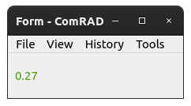

.. rst_epilog sometimes fails, so we need to include this explicitly, for colors
.. include:: <s5defs.txt>

Widget rules
============

Most of ComRAD widgets have a capability to define "rules". Rules system lets you modify common widget properties,
such as opacity or visibility based on the incoming channel value. One common use-case for widget rules is applying
custom colors to the labels.

- `Overview`_

  * `Numeric Range Rules`_
  * `Enum Rules`_

- `Setting rules in ComRAD Designer`_
- `Setting rules in code`_

Overview
--------

Rule is a special construct that can be executed whenever a new value arrives from the channel. It acts on a single
property of the widget (e.g. *Opacity*, *Visibility*, *Enabled* or *Color* in some cases) and can set this property
to a value that depends on the channel value. Rules can have different, however at this time only two type are
implemented - `Numeric Range Rules`_ and `Enum Rules`_. Rules get evaluated in a separate thread to not block the UI
on heavy calculations. Recalculation is triggered every 33ms.

Numeric Range Rules
^^^^^^^^^^^^^^^^^^^

This kind of rules compare whether the incoming channel value falls into a defined numeric range and can set the
property to a predefined value, corresponding to the range.

For instance, you can define a rule that works with the :ref:`clabel` receiving a `float`, to adjust its
color:

- Values 0.5-1.0 → :green:`Green`
- Values 0.0-0.5 → :red:`Red`

All the values outside of these ranges will fallback to the default text color of the :ref:`clabel`, which
can also be altered via custom :ref:`stylesheets <intro:Using alternative color schemes>`.

The result will be visible at runtime:

.. table::

   =======  =======
   |red|    |green|
   =======  =======

Enum Rules
^^^^^^^^^^

Enum rules allow comparing one of the supported fields of the control system enums against the predefined value. These
fields are:

- Code
- Label
- Meaning

For instance, if you have a device property field of type "enum" in CCDB with the following entries:

========  =========  ===========
**Code**  **Label**  **Meaning**
--------  ---------  -----------
1         ON         ON
2         OFF        OFF
3         UNDEF      NONE
========  =========  ===========

You can define, say, a color rule that you would attach to a :ref:`clabel` or a :ref:`cled`. In this
case, you could configure the rule to have 3 entries:

- "ON" states → :green:`Green`
- "OFF" states → :red:`Red`
- "UNDEF" states → :gray:`Gray`

However, you can choose how to perform the comparison:

- Compare code against integers: 1, 2 or 3
- Compare label against strings: "ON", "OFF" or "UNDEF"
- Compare meaning against :attr:`~comrad.data.japc_enum.CEnumValue.ON`, :attr:`~comrad.data.japc_enum.CEnumValue.OFF`
  or :attr:`~comrad.data.japc_enum.CEnumValue.NONE`

Setting rules in ComRAD Designer
--------------------------------

To edit rules of a widget, right click on the widget in ComRAD Designer to bring up its context menu. Then select
"Edit Rules..." menu. This will open a rules dialog. Start by creating anew rules, and the configure it.

   Numeric range rule in Rules editor

If you leave "Use default channel" checkbox marked, it will use the standard channel of the widget to evaluate the
rules (e.g. the one defined through channel property of :ref:`clabel`). Alternatively, you can unmark the
checkbox and enter any arbitrary channel address.

For `Numeric Range Rules`_ and `Enum Rules`_, the evaluation UI consists of

- "Declarative view", where you can define the ranges using "+", "-" buttons
- "Source view", which gives you representation of ranges in JSON format. This is helpful, when you want to duplicate
  the ranges between the widgets, simply copy it from one "Source view" and paste into another one.

Enum rules has a similar table, but with different configuration options inside

   Enum rule in Rules editor

Setting rules in code
---------------------

In code, you assign rules on the rules property of the widget. Here, you should use special rule classes to construct
the rule definition, e.g.:

.. code-block:: python
   :linenos:

   from comrad import CLineEdit
   from comrad.rules import CNumRangeRule, CEnumRule

   ...
   my_label = CLineEdit()
   my_label.rules = [
       CNumRangeRule(name='My range rule',
                     prop=CNumRangeRule.Property.COLOR,
                     ranges=[
                         CNumRangeRule.Range(min_val=0.0, max_val=0.5, prop_val='#FF0000'),
                         CNumRangeRule.Range(min_val=0.5, max_val=1.0, prop_val='#00FF00'),
                     ]),
       CEnumRule(name='My enum rule',
                 prop=CEnumRule.Property.ENABLED,
                 config=[
                     CEnumRule.EnumConfig(field=CEnumRule.EnumField.LABEL, field_val='ON', prop_val=True),
                     CEnumRule.EnumConfig(field=CEnumRule.EnumField.LABEL, field_val='OFF', prop_val=False),
                 ]),
   ]
   ...
