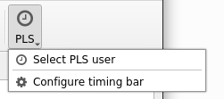
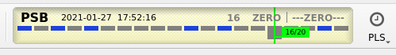
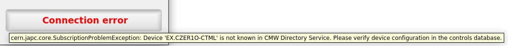
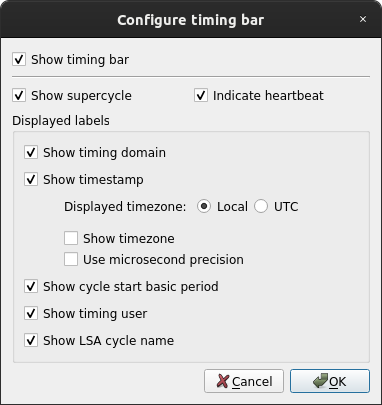
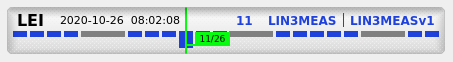

Timing
======

- `Errors`_
- `Configuration`_

  * `In the GUI`_
  * `With command line arguments at launch`_

- `Modes`_

As explained in :ref:`basic/controls:Altering application-wide cycle selector`, cycle selectors are the primary means
of controlling timing user in ComRAD applications. For some operational applications it might be important to display
the played user in a graphical manner, possibly aligned with the supercycle diagram for relevant timing domains.

ComRAD allows displaying timing bar, which is configured using the same "PLS" navigation bar button, that you use to
choose a cycle selector.

   PLS button menu

Click "Configure timing bar" to enable the timing bar that reflects the diagram of the timing domain corresponding to
currently selected cycle. When enabled, the timing bar will be displayed on the left from the "PLS" button.

   PLS button with timing bar enabled

Here, the cycles that correspond to the selected application-wide cycle (timing user) will be colored in blue, while
all others will remain gray (colors are subject to the
:ref:`selected stylesheet <intro:Using alternative color schemes>` and may be altered, e.g. in the dark mode).

Errors
-------

Because the timing bar is relying on connection to RDA devices, it is susceptible to connection problems. When the error
happens, the widget rendering is switched to the error mode. Here, the label is fixed to "Connection error". However,
the actual error message can be seen in the tooltip, by hovering mouse over the widget.

   Connection error in the timing bar

Configuration
-------------

Timing bar can be configured to present all or part of available information.

In the GUI
^^^^^^^^^^

In running application this is available in the same "Configure timing bar" dialog.

   Timing bar configuration dialog

- *Show supercycle*: The widget is divided into 2 rows: information labels on the top, and the supercycle structure
  in the lower part. Optionally, the lower part can be hidden, leaving only the labels on screen.
- *Indicate heartbeat*: The heartbeat (advancement of the time) is indicated in the widget by alternating its
  background color. This can be optionally switched off, to reduce distractions.
- *Show timing domain*, *Show timestamp*, *Show cycle start basic period*, *Show timing user*, *Show LSA cycle name*:
  These are individual labels in the upper half of the timing bar.
- *Use microsecond precision*: Choice between second or microsecond precision in the timestamp.
- *Show timezone*: display timezone of the timestamps that corresponds to the configured one (UTC or local).

With command line arguments at launch
^^^^^^^^^^^^^^^^^^^^^^^^^^^^^^^^^^^^^

All of the configuration can be made at launch, to avoid reconfiguring the timing bar every time application is
launched. In this case, ``--window-plugin-config`` flag should be used. It accepts multiple key-value pairs, e.g.

.. note:: When multiple argument flag is supplied last, don't forget to terminate the list using ``--`` delimiter,
          otherwise application filename will be recognized as another argument to the list.

.. code-block:: bash

   comrad run \
     --window-plugin-config comrad.pls.show_bar=1 comrad.pls.heartbeat=0 -- \
     /path/to/app.ui

It is often useful to launch timing bar-enabled application with a predefined timing user:

.. code-block:: bash

   comrad run \
     -s PSB.USER.MD3 \
     --window-plugin-config comrad.pls.show_bar=1 -- \
     /path/to/app.ui

Modes
-----

Timing bar can operate in 2 modes:

#. For timing domains that have a supercycle (e.g. *CPS*, *PSB*, *SPS*, etc), the supercycle diagram reflects its
   structure, respecting the amount and the length of individual cycles.
#. For other timing domains, supercycle does not exist, and thus the diagram will be fixed at showing space of
   128 blocks, each of 1 basic period in length (1.2 seconds). This diagram will not be prefilled with blocks, like
   in supercycle, but will draw the blocks as the time progresses.

.. table::
   :widths: 1 1

   ===================  ======================
   **With supercycle**  **Without supercycle**
   |supercycle|         |nosupercycle|
   ===================  ======================

For the supercycle mode, the BCD (Beam Coordination Diagram) structure supports both normal supercycle and spare
supercycles. Spare supercycle serves as a backup, in case the normal supercycle cannot be followed. The timing bar
will display the one that is actually being played: if the latest timing update indicates that the system switched
from the normal supercycle to spare, or vice versa, the bar's supercycle diagram will reflect this change.
