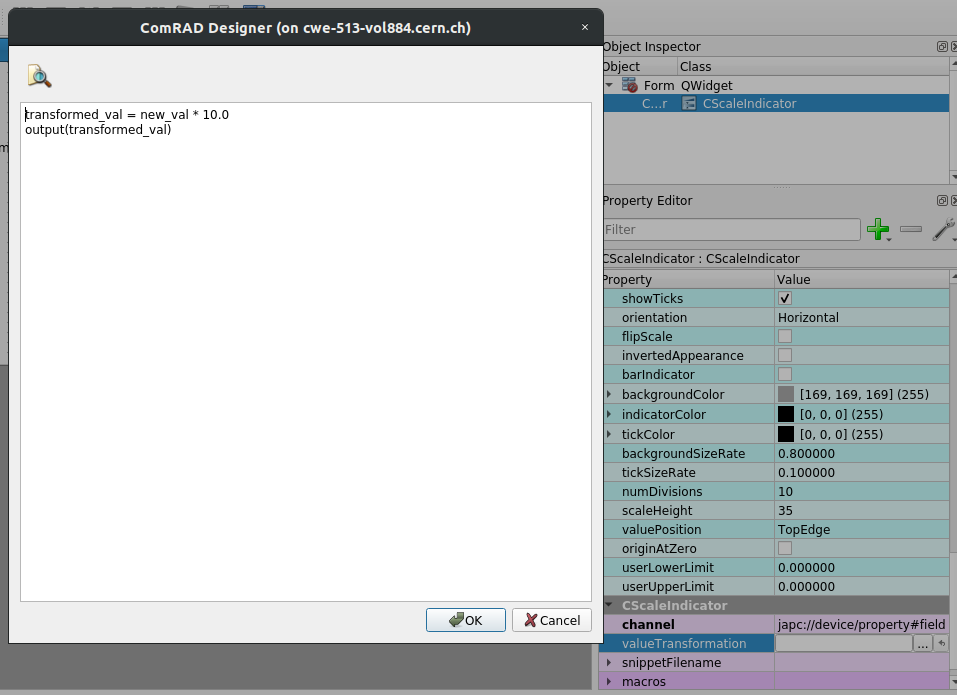

Client-side data transformations
================================

ComRAD allows you to perform lightweight transformations on incoming data before it gets displayed.

.. note:: We strongly advice keeping UI layer as thin as possible without any complex logic in it. Thus, client-side
          transformations are meant for really simple logic, few lines of code. Consider implementing your logic in a
          **FESA class** or using
          `UCAP service <https://wikis.cern.ch/display/UCAP/Unified+Controls+Acquisition+and+Processing+Framework+Home>`__.

Contents:

- `Inline transformation`_

  * `In ComRAD Designer`_
  * `In code`_

- `External Python files`_
- `Importing modules from the Python snippet`_

  * `Module names`_

- `Using CValueAggregator widget`_

This feature is attached to selected widgets that are displaying incoming data, e.g. :ref:`clabel`,
:ref:`cscaleindicator`, :ref:`clineedit` and similar.

Each of the widget has the following properties:

- :attr:`~comrad.widgets.value_transform.CValueTransformationBase.valueTransformation`: used for inline Python code
  snippets
- :attr:`~comrad.widgets.value_transform.CValueTransformationBase.snippetFilename`: used to load code from external
  Python files

These properties can be configured in ComRAD Designer or assigned in code.

:attr:`~comrad.widgets.value_transform.CValueTransformationBase.valueTransformation` has the precedence, i.e. inline
code will be used instead of the external Python file, if both are defined.

No matter, inline code snippet or loading an external file, the code is treated equally. It's valid Python, with few
minor details:

#. ``output`` is a reserved name of a function that you should call in order to propagate the value to the widget.
   Hence, ``output(10)`` will propagate value "10" to the widget, as if it was coming directly from the control system.
#. Incoming values are propagated inside ``values`` dictionary for :ref:`cvalueaggregator` widget,
   or as ``new_val`` variable for all other widgets.
#. Incoming meta-information is propagated inside ``headers`` dictionary for :ref:`cvalueaggregator`
   widget, or as ``header`` variable for all other widgets.
#. All regular widgets (except :ref:`cvalueaggregator`) receive ``widget`` variable that is the
   reference to the widget object (if you want to modify widget properties as a side effect, which is not encouraged).
#. :obj:`__file__` variable will be preset to the path of the file, where the code comes from. If
   :attr:`~comrad.widgets.value_transform.CValueTransformationBase.valueTransformation` property is defined inside the
   \*.ui file, path to this \*.ui file will be assigned, i.e. ``print(__file__)`` will output something like
   ``/absolute/path/to/my/designer/file.ui``. If used from the external Python file, or the file imported into the
   snippet, path to that Python file will be set, i.e. setting
   :attr:`~comrad.widgets.value_transform.CValueTransformationBase.snippetFilename` inside
   ``/absolute/path/to/my/designer/file.ui`` to ``external.py`` will result in :obj:`__file__` being equal to
   ``/absolute/path/to/my/designer/external.py``.

Inline transformation
---------------------

In ComRAD Designer
^^^^^^^^^^^^^^^^^^

Click on the ``...`` button next to the
:attr:`~comrad.widgets.value_transform.CValueTransformationBase.valueTransformation` field in Property Editor to open
code editing dialog. Here, you can write a custom snippet in Python. For instance, the following transformation
snippet will multiply incoming value by 10, before displaying it in the widget:

.. code-block:: python
   :linenos:

   transformed_val = new_val * 10.0
   output(transformed_val)

   Configuration of valueTransformation property in ComRAD Designer

In code
^^^^^^^

To assign a Python snippet in code, simply modify
:attr:`~comrad.widgets.value_transform.CValueTransformationBase.valueTransformation` property of the widget:

.. code-block:: python
   :linenos:

   widget = ...
   widget.valueTransformation = """
   transformed_val = new_val * 10.0
   output(transformed_val)
   """

External Python files
---------------------

External Python files are assigned via :attr:`~comrad.widgets.value_transform.CValueTransformationBase.snippetFilename`
property, that indicates relative path from the containing directory of the \*.ui file, or the Python file containing
the parent :class:`~comrad.CDisplay`. Thus, if indicated in ComRAD Designer inside file
``/absolute/path/to/my/designer/file.ui`` as e.g. "relative/external.py", path to that Python file will be
``/absolute/path/to/my/designer/relative/external.py`` (notice "relative" component). In case of the code-centric
approach, setting

.. code-block:: python

   widget.snippetFilename = 'relative/external.py'

inside ``/absolute/path/to/my/python/file.py`` containing a :ref:`cdisplay` subclass, will result in the
snippet being loaded from ``/absolute/path/to/my/python/relative/external.py``.

Importing modules from the Python snippet
-----------------------------------------

When you run an inline snippet, the containing directory of the \*.ui file gets added to the :obj:`sys.path`, which
means that you can import modules from the same directory or child directories. Similarly, external Python files
get their containing directory imported. For instance, an external Python at path ``/path/to/external/file.py`` can
contain

.. code-block:: python

   import my_module

which will resolve to the Python file ``/path/to/external/my_module.py``.

Module names
^^^^^^^^^^^^

When referencing external Python files via
:attr:`~comrad.widgets.value_transform.CValueTransformationBase.snippetFilename`, their :obj:`__name__` variable is
turned into :obj:`__main__`. That means, that you can have a construct

.. code-block:: python

   if __name__ == '__main__':

which allows protecting the code that is meant for files that are referenced directly, and is not executed when the
file is being imported. For instance, you can have a versatile snippet, that defines functions to be imported by other
files, but can also run them when being used directly:

.. code-block:: python
   :linenos:

   def my_func(val: int):
       return val * 10.0

   if __name__ == '__main__':
       transformed_val = my_func(new_val)
       output(transformed_val)

The above file can be imported by another snippet file, e.g.:

.. code-block:: python
   :linenos:

   from my_module import my_func
   transformed_val = my_func(new_val)
   output(transformed_val)

Using CValueAggregator widget
-----------------------------

:ref:`cvalueaggregator` is a special kind of widget that can be added to the dashboard
(programmatically or via ComRAD Designer) but is not visible at runtime. Its purpose is to provide client-side data
transformation for data on one or more property fields. User configures channels to which this widget connects and
attaches Python transformation.

.. include:: ../shared/cvalueaggregator_example.rst

.. seealso:: :doc:`Read more about applications of CValueAggregator <../api/widgets/cvalueaggregator>`
