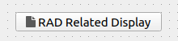
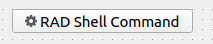
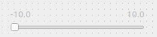
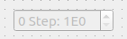
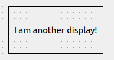
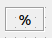

Widget overview
===============

ComRAD widgets in many cases are direct counterparts of the standard Qt Widgets
(e.g. :ref:`CLabel <clabel>` is merely a fancier :class:`QLabel`).
They can also be compound - constructed of several primitive Qt Widgets (e.g. :ref:`CLogDisplay <clogdisplay>`),
or completely custom - PyQtGraph descendants are :class:`QGraphicsView` descendants.

All ComRAD widgets are C-prefixed, and follow the Q-prefix notation of Qt.

.. note:: The primary reason for C-prefixed names was the way Qt Designer displays custom widgets - it only
          can use class name as a widget display name. Thus, to differentiate ComRAD widget from regular Qt
          Widgets, e.g. "ComRAD Label" from "Label", we introduced C-prefix.

**Page contents:**

- `Widget categories`_
- `Index of widgets`_

Widget categories
-----------------

In ComRAD Designer they are placed in the sections that correspond to the standard Qt Designer widget organization:

- *Display widgets*
- *Buttons*
- *Input widgets*
- *Containers*

There are also new additional sections:

- *Charts*: for plotting widgets
- *Invisible widgets*: for widgets that are visible in Designer but hidden at runtime

Index of widgets
----------------

.. table::
   :widths: 50, 50

   ===================  ==================================================================
   **Display widgets**
   =======================================================================================
   CLabel
   ---------------------------------------------------------------------------------------
   |clabel|             .. _clabel:

                        Label that can display values in the read-only manner.
                        Normally, strings or numbers are expected from the control
                        system.
   CByteIndicator
   ---------------------------------------------------------------------------------------
   |cbyteindicator|     .. _cbyteindicator:

                        Array of bits that can display binary values ("ON" / "OFF").
                        Bits can be named individually. You can adjust the number of
                        bits displayed, but no gaps are intended, i.e. if you wish to
                        display only 1st, 3rd and 5th bit, consider converting them to
                        individual boolean fields. This widget can work with **booleans**
                        for a single bit, **integers** representing the array of bits in
                        binary notation, or **BitEnums**.
   CLogDisplay
   ---------------------------------------------------------------------------------------
   |clogdisplay|        .. _clogdisplay:

                        | **Note! This component is not related to the logs**
                          **control system, such as Timber / CALS / NXCALS.**
                        Log display simply captures conventional Python
                        :class:`logging.Logger` output to display messages in the UI, when
                        console output cannot be seen, e.g. when launched form CCM. These
                        loggers are the same ones that are usually used to print console
                        messages (do not confuse with :func:`print` function), so you can
                        capture stdout and stderr output here.
   CScaleIndicator
   ---------------------------------------------------------------------------------------
   |cscaleindicator|    .. _cscaleindicator:

                        Scale Indicator is a read-only slider that displays the numeric
                        value in perspective with pre-configured range.
   ===================  ==================================================================

.. table::
   :widths: 35, 65

   ===================  ==================================================================
   **Buttons**
   =======================================================================================
   CCheckBox
   ---------------------------------------------------------------------------------------
   |ccheckbox|          .. _ccheckbox:

                        Checkbox allows you setting **boolean** or **integer** (0 or 1)
                        value in the control system.
   CEnumButton
   ---------------------------------------------------------------------------------------
   |cenumbutton|        .. _cenumbutton:

                        This button creates a button group (similar to radio button
                        group). It is similar to combobox but has possible options at
                        hand. Each button can send a predetermined value to the control
                        system.
   CCommandButton
   ---------------------------------------------------------------------------------------
   |ccommandbutton|     .. _ccommandbutton:

                        Command button is meant to issue commands. In contrast with other
                        buttons, it can operate on the property level, not field. Because
                        commands are properties with no fields inside them, this button
                        issues a SET instruction to a property without any value.
   CRelatedDisplayButton
   ---------------------------------------------------------------------------------------
   |crelateddisplay|    .. _crelateddisplay:

                        Related display is a navigation button, which is not related to
                        the control system. It can either open a new ComRAD window with
                        another dashboard (e. g. details screen of a particular device),
                        or replace the current window with a new dashboard.
   CShellCommand
   ---------------------------------------------------------------------------------------
   |cshellcommand|      .. _cshellcommand:

                        Shell command button can issue a local Linux command, such as
                        launching external scripts, processes or applications.
   ===================  ==================================================================

.. table::
   :widths: 40, 60

   ===================  ==================================================================
   **Input widgets**
   =======================================================================================
   CEnumComboBox
   ---------------------------------------------------------------------------------------
   |cenumcombobox|      .. _cenumcombobox:

                        This combobox is similar to CEnumButton but displays options in
                        the drop-down menu.
   CLineEdit
   ---------------------------------------------------------------------------------------
   |clineedit|          .. _clineedit:

                        Single-line string editor that allows propagating a string or
                        numeric value into the control system. The changes are submitted
                        when the user presses "Enter".
   CSlider
   ---------------------------------------------------------------------------------------
   |cslider|            .. _cslider:

                        Slider allows adjusting a numeric value in the control system,
                        given the possible range.
   CSpinBox
   ---------------------------------------------------------------------------------------
   |cspinbox|           .. _cspinbox:

                        Spinbox allows altering a numeric value with a certain step
                        between adjacent values. The changes are submitted when the user
                        presses "Enter".
   ===================  ==================================================================

.. table::
   :widths: 35, 65

   ===================  ==================================================================
   **Containers**
   =======================================================================================
   CEmbeddedDisplay
   ---------------------------------------------------------------------------------------
   |cembeddeddisplay|   .. _cembeddeddisplay:

                        Embedded Display renders another file (either \*.ui or Python file
                        with CDisplay subclass defined) inside a frame. It allows nesting
                        displays inside each other. Embedded file can receive customized
                        variables via the :doc:`macros <macros>` system.
   CTemplateRepeater
   ---------------------------------------------------------------------------------------
   |ctemplaterepeater|  .. _ctemplaterepeater:

                        Template repeater is a special kind of Embedded Display that
                        allows creating multiple instances of the same display,
                        customizing each of them via the :doc:`macros <macros>` system.
                        For instance, you can display information about multiple devices
                        side by side without duplicating UI during development.
   ===================  ==================================================================

.. table::
   :widths: 60, 40

   ===================  ==================================================================
   **Charts**
   =======================================================================================
   CScrollingPlot
   ---------------------------------------------------------------------------------------
   |cscrollingplot|     .. _cscrollingplot:

                        Scrolling plot displays live data that is arriving from the
                        control system in real time. This data can be represented in
                        multiple ways, e.g. as lines, bar graph, injection marks, etc.
                        Data can either contain a timestamp to be precise about timing, or
                        such timestamp will be created whenever the widget receives the
                        data.
   CCyclicPlot
   ---------------------------------------------------------------------------------------
   |ccyclicplot|        .. _ccyclicplot:

                        Cyclic plot is meant to scroll through the same cycle updating the
                        previous display, similar to how heart monitors do it. It is
                        useful for displaying data in the context of a cycle of the
                        injector / accelerator.
   ===================  ==================================================================

.. table::
   :widths: 20, 80

   =====================  ==================================================================
   **Invisible widgets**
   =========================================================================================
   CValueAggregator
   -----------------------------------------------------------------------------------------
   |cvalueaggregator|     .. _cvalueaggregator:

                          Hidden widget that allows combine data from multiple sources to
                          produce a single output using Python code to describe logic. See
                          :doc:`transform` for more information.
   =====================  ==================================================================

.. |clabel| image:: ../img/widget_clabel.png
.. |cbyteindicator| image:: ../img/widget_cbyteindicator.png
.. |clogdisplay| image:: ../img/widget_clogdisplay.png
.. |cscaleindicator| image:: ../img/widget_cscaleindicator.png
.. |ccheckbox| image:: ../img/widget_ccheckbox.png
.. |cenumbutton| image:: ../img/widget_cenumbutton.png
.. |ccommandbutton| image:: ../img/widget_ccommandbutton.png

.. |cenumcombobox| image:: ../img/widget_ccombobox.png

.. |ctemplaterepeater| image:: ../img/widget_ctemplaterepeater.png
.. |cscrollingplot| image:: ../img/widget_cscrollingplot.png
.. |ccyclicplot| image:: ../img/widget_ccyclicplot.png

