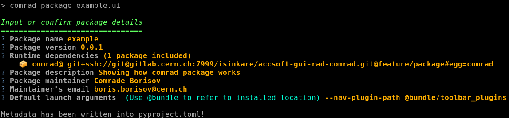

Deployment
==========

- `Operational deployment`_
- `Console Configuration Manager (CCM)`_
- `Command Line Interface of the packaged application`_
- `Make it installable from local directory`_
- `Make it installable from git repository`_
- `Installing a wheel or sdist`_
- `In-depth "comrad package"`_

  * `Implicit launch arguments`_
  * `Enabling phonebook`_
  * `Automatic dependency scanning`_

- `Using alternative build tools`_

Deploying ComRAD applications is done using same tools as for other Python packages. To be able to use these tools,
ComRAD application needs to be arranged in a specific manner. ``comrad package`` command helps to achieve this
arrangement by producing a ``pyproject.toml`` file, recognized by build tools compatible with
`PEP-517 <https://www.python.org/dev/peps/pep-0517/>`__, e.g. `pip`.

Operational deployment
----------------------

In a nutshell, deploying an operational application comprises 3 steps:

#. Produce a ``pyproject.toml`` inside application's source location with ``comrad package`` command
#. Build a wheel (binary package) with standard tools, e.g. ``pip wheel . --no-deps``
#. Deploy the wheel to the acc-py: ``acc-py app deploy <wheel>``

.. seealso:: For specific "acc-py app deploy" workflows (e.g. dependency locking) refer to
             `its documentation <https://gitlab.cern.ch/acc-co/devops/python/acc-py-deploy/-/blob/master/README.md>`__.

.. note:: ComRAD assumes that the file supplied in the arguments (``app.ui`` in case of
          ``comrad package /path/to/project/app.ui``) is located directly in the root of the project (in this
          example ``/path/to/project``). As a best practice, ``/path/to/project`` should be a self-contained
          directory that is tracked by the version control, such as *git*). Contents of this directory will be copied
          into the final product. Same contents will be also inspected when performing
          `Automatic dependency scanning`_.

          Therefore, **avoid** trying to package freely floating files located beside large directories of
          irrelevant contents. Also, avoid having virtual environments in the same directory.

Console Configuration Manager (CCM)
-----------------------------------

The deployed application then can be accessed in CCM for operational use by creating a new application entry in
`CCM Editor <https://wikis.cern.ch/display/CCM/CCM+editor+application>`__:

#. Make sure to select the "acc-py app" tool.
#. Use app name version as the first argument in the "Linux command line" box
#. You may optionally use command line arguments in the "Linux command line" after the application name

.. figure:: img/ccm.png
   :align: center
   :alt: Deploying an acc-py-deployed Python application in CCM Editor

   Deploying an acc-py-deployed Python application in
   `CCM Editor <https://wikis.cern.ch/display/CCM/CCM+editor+application>`__

Command Line Interface of the packaged application
--------------------------------------------------

Packaged application will have a command line interface replicating ``comrad run``, without the need for
the entrypoint file. Therefore, running

.. code-block:: bash

   python -m my_custom_app -s PSB.USER.ALL

is equivalent to (if the packaged application was named after its entrypoint file)

.. code-block:: bash

   comrad run -s PSB.USER.ALL my_custom_app.ui

User can explore the possibilities with ``python -m my_custom_app -h``, e.g.:

.. code-block:: bash

   $ python -m my_custom_app -h
   usage: python -m my_custom_app [--use-profile PROFILE_NAME | --save-to-profile PROFILE_NAME]
                                  [-m MACRO] [--read-only] [--hide-menu-bar]
                                  [--hide-log-console] [--hide-status-bar] [--hide-nav-bar]
                                  [--nav-bar-style {icon,text,vstack,hstack}]
                                  [--nav-bar-position {top,left}] [--fullscreen]
                                  [--stylesheet QSS] [--dark-mode] [-s SELECTOR]
                                  [--rbac-token abcdef123456] [--no-inca]
                                  [--cmw-env {PRO,TEST,INT,DEV,PRO2,TEST2,INT2,DEV2}]
                                  [--java-env key=value [key=value ...]]
                                  [--extra-data-plugin-path [PATH [PATH ...]]]
                                  [--enable-plugins ID [ID ...]]
                                  [--disable-plugins ID [ID ...]]
                                  [--status-plugin-path PATH [PATH ...]]
                                  [--menu-plugin-path PATH [PATH ...]]
                                  [--nav-plugin-path PATH [PATH ...]]
                                  [--nav-bar-order ID [ID ...]]
                                  [--window-plugin-config key=value [key=value ...]]
                                  [--log-level {DEBUG,INFO,WARNING,ERROR,CRITICAL}]
                                  [--perf-mon] [-h]
                                  FILE ...

     This command launches the client application with ComRAD environment.
     It is the starting point for runtime applications that have been
     developed with ComRAD tools and rely on control system marshalling
     logic and other conveniences provided by ComRAD.

   ...

Make it installable from local directory
----------------------------------------
Once ``pyproject.toml`` is generated by ``comrad package`` command, the directory containing it becomes automatically
installable, so the following scenario is plausible:

.. code-block:: bash

   cd /path/to/my/app
   comrad package my_custom_app.ui
   # from anywhere
   pip install /path/to/my/app

.. seealso:: To learn more about ``comrad package``, see `In-depth "comrad package"`_.

.. note:: ``pyproject.toml``-based code bases are not compatible with `pip`'s editable mode, therefore
          ``pip install -e /path/to/my/app`` will throw an error.

Make it installable from git repository
---------------------------------------
Once ``pyproject.toml`` is generated by ``comrad package`` command, the git repository containing it becomes
automatically installable, as long as ``pyproject.toml`` is checked into git, so the following scenario is plausible:

.. code-block:: bash

   cd /path/to/my/app
   comrad package my_custom_app.ui
   git add ./pyproject.toml
   git commit -m "Created pyproject.toml"
   git push
   # from anywhere, provided that git repo URL is correct
   pip install git+ssh://git@gitlab.cern.ch:7999/myusername/my-app.git

.. seealso:: To learn more about ``comrad package``, see `In-depth "comrad package"`_.

.. note:: ``pyproject.toml``-based code bases are not compatible with `pip`'s editable mode, therefore
          ``pip install -e git+ssh://git@gitlab.cern.ch:7999/myusername/my-app.git`` will throw an error.

Installing a wheel or sdist
---------------------------

Installation from packages in standard formats is not specific for ComRAD, and can be carried out by standard tools,
once these packages are produced. For instance, once a wheel file exists, it can be installed directly, e.g.

.. code-block:: bash

   cd /path/to/my/app
   comrad package my_custom_app.ui
   pip wheel . --no-deps
   # from anywhere, provided that wheel filename matches
   pip install /path/to/my/app/my_custom_app-0.0.1-py3-none-any.whl

.. seealso:: To learn more about ``comrad package``, see `In-depth "comrad package"`_.

Installing from an sdist follows the same pattern, albeit pip is not capable of building an sdist. A
`PEP-517 <https://www.python.org/dev/peps/pep-0517/>`__ compatible tool that can build sdists is `build`.

.. code-block:: bash

   cd /path/to/my/app
   comrad package my_custom_app.ui
   python -m build -s .
   # from anywhere, provided that sdist filename matches
   pip install /path/to/my/app/dist/my_custom_app-0.0.1.tar.gz

.. seealso:: `Using alternative build tools`_

In-depth "comrad package"
-------------------------

``comrad package`` generates ``pyproject.toml`` in a format that later can be used to compile a ComRAD application into
a distributable package. It can be run in a non-interactive mode in CI (use ``comrad package -h`` to discover
configuration arguments). But by default it works in an interactive mode, allowing user to specify application metadata.

   Example of completed "comrad package" sequence

If ``pyproject.toml`` already exists, its contents will be used as a cache, so that the user does not write lengthy
descriptions every time. It must be run on every application release, at least to update the version number. Alongside
basic information, ``comrad package`` detects used external Python packages, and allows to interactively confirm the
list of dependencies.

   Example of "comrad package" dependency definition

.. seealso:: To learn more how dependency scanning works, refer to `Automatic dependency scanning`_.

Dependencies are cross-checked with implicit ComRAD requirements, and those matching are deselected by default (though
user can select them back). New packages are selected by default. ComRAD does not expect to perfectly detect
dependencies in all cases 100% of the time, therefore user can extend the list by inserting a new item (toggle this mode
with ``a`` key). New entries are expected to follow `PEP-508 <https://www.python.org/dev/peps/pep-0508/>`__ format, so
``tensorflow``, ``tensorflow==2.4.1``, ``tensorflow>1,<=2.3`` or ``tensorflow==2;python_version<"3.8"`` are all valid
options.

   Example of entering additional dependencies

Beside being smart about detecting dependencies, ComRAD may infer maintainer name from the current OS user, provided
that :mod:`pyphonebook` is installed in the system. This dependency is optional, and maintainer information will not be
suggested, if there's any problem with accessing the CERN phonebook.

Implicit launch arguments
^^^^^^^^^^^^^^^^^^^^^^^^^

It is possible to make the application launch by default with selected launch arguments, by entering them into
"Default launch arguments" answer, in the same way as you would've normally supplied it to "comrad run" command.
Several launch arguments can be combined simply separating them with spaces.

.. note:: User is still able to override these arguments at launch.

This can be useful for applications that are supposed to work only with the certain control system configuration
(e.g. by providing selector: ``-s PSB.USER.MD3``) or for applications that want to reconfigure their look and feel.

In addition, an application may bundle extensions, such as ComRAD :doc:`advanced/plugins`. In that case, use ``@bundle``
keyword when providing a plugin path argument, to signify that this location is relative to your installed application,
where ``@bundle`` will be resolved to the containing directory of your main application file.

.. code-block::

   --nav-plugin-path @bundle/toolbar_plugins

Enabling phonebook
^^^^^^^^^^^^^^^^^^

Refer to :mod:`pyphonebook` documentation in order to install it. Phonebook will be contacted only if the library is
installed and the server is accessible. In case of any troubles, execution will continue without suggesting maintainer
info. Phonebook is also not accessed, when ``pyproject.toml`` is already existing. In that case, ComRAD prioritizes
cached information, and if it does not contain maintainer information, it assumes that this is deliberate.

May you wish to resolve maintainer information from the phonebook, even if existing ``pyproject.toml`` contains
empty entries, use ``--force-phonebook`` flag in ``comrad package`` to express that.

Automatic dependency scanning
^^^^^^^^^^^^^^^^^^^^^^^^^^^^^

ComRAD scans for project's dependencies by inspecting source files. It does that in 2 different ways:

- Scan each Python file available in the same directory or subdirectories, as the specified entrypoint file.
  ``import <package name>`` or ``from <package name> import`` statements are collected into requirements.
- Scan each Designer file (\*.ui) available in the same directory or subdirectories, and detect references:

  * Detect custom widgets (from promoted widgets) and their respective Python packages
  * Detect referenced Python files in :attr:`~comrad.widgets.value_transform.CValueTransformationBase.snippetFilename`
    properties of widgets supporting :doc:`basic/transform`, and scan their dependencies in the same way as other
    Python files.
  * Detect ``import <package name>`` or ``from <package name> import`` statements in the
    :attr:`~comrad.widgets.value_transform.CValueTransformationBase.valueTransformation` properties
    of widgets supporting :doc:`basic/transform`.

Collected number of dependencies is then shortlisted by removing dependencies that appear to be relative imports. Only
those assumed to be external packages are handed over.

Using alternative build tools
-----------------------------

`pip` is not the only compatible tool for ComRAD. Because ComRAD implements
`PEP-517 <https://www.python.org/dev/peps/pep-0517/>`__, any tool compatible with this standard shall be able to
produce a proper package. This opens a possibility for future tools as well. In this PEP, they are called
"build frontends".

Another build frontend in addition to `pip` is `build`. Unlike `pip`, `build` can not only produce wheels, but also
sdists. You can install `build` from `PyPI <https://pypi.org/project/build/>`__.

.. code-block:: bash

   pip install build

To build a wheel:

.. code-block:: bash

   python -m build -w /path/to/my/app

To build a sdist:

.. code-block:: bash

   python -m build -s /path/to/my/app
