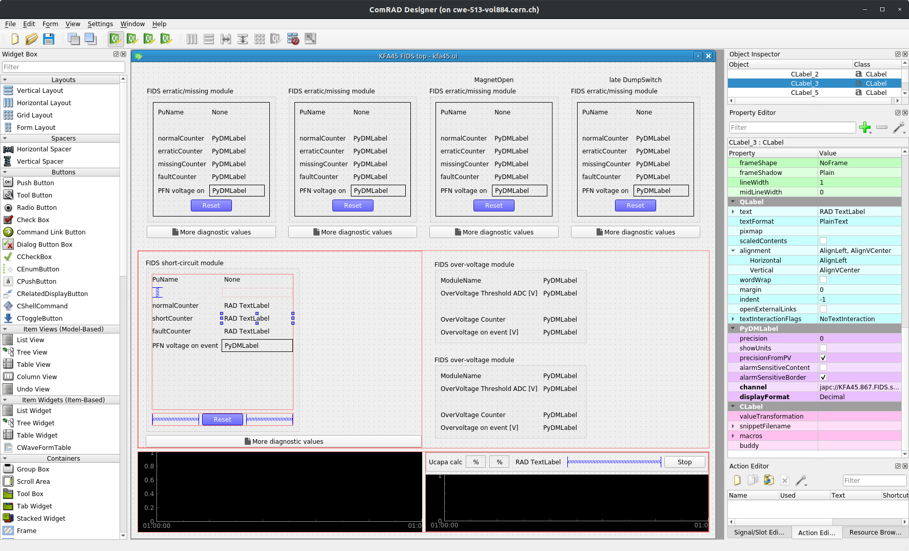
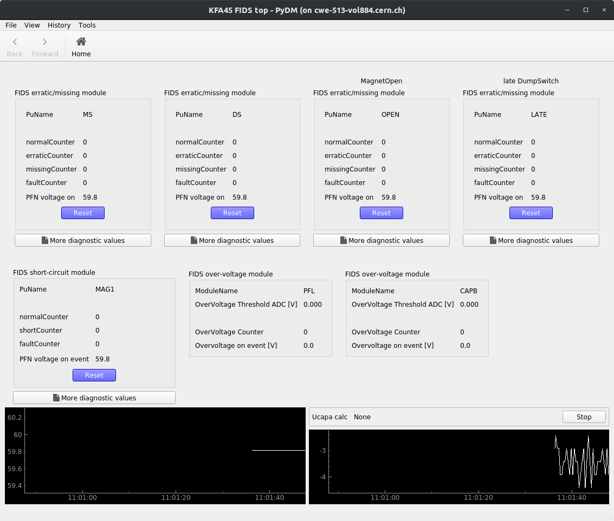

.. comrad documentation master file, created by
   sphinx-quickstart on Wed Aug 14 09:50:41 2019.
   You can adapt this file completely to your liking, but it should at least
   contain the root `toctree` directive.

ComRAD
==================================

.. automodule:: comrad

Quick links
-----------

- API reference: :doc:`Sphinx <api/index>`
- Issue tracker: `JIRA <https://issues.cern.ch/browse/ACCPY-279?jql=project%20%3D%20ACCPY%20AND%20resolution%20%3D%20Unresolved%20AND%20labels%20%3D%20ComRAD>`__
- Git repo: `Gitlab <https://gitlab.cern.ch/acc-co/accsoft/gui/rad/accsoft-gui-rad-comrad>`__
- Support:

  * |mailing-list| Email: `acc-python-support@cern.ch <mailto:acc-python-support@cern.ch>`__
  * |mattermost| Mattermost: `acc-py`_

- Announcements:

  * |mailing-list| Mailing list: `acc-python-community@cern.ch <mailto:acc-python-community@cern.ch>`__ (`e-group <https://e-groups.cern.ch/e-groups/Egroup.do?egroupId=10326414>`__)
  * |mattermost| Mattermost: `acc-py`_

Wiki contents
-------------

.. toctree::
   :maxdepth: 2

   install
   intro
   basic/index
   advanced/index
   api/index
   deploy
   Changelog <https://gitlab.cern.ch/acc-co/accsoft/gui/rad/accsoft-gui-rad-comrad/-/releases>

Contents of this page
----------------------

- Description_
- `Design time`_
- `Run time`_

Description
-----------

Rapid Application Development framework allows quick development of Python (PyQt) based applications
across CERN accelerator domain.

The following use-cases are foreseen:

#. Development of prototypes and throw-away applications
#. Development of test and utility applications for machine design
#. Evolution of a prototype into a full-fledged PyQt production application

It is achieved by the powerful flexibility of PyQt - users can quickly write Python code and launch a GUI
application, skipping cumbersome compilation step, necessary for Qt/C++ applications. It comes with the
integration with Qt Designer - drag-n-drop user interface design tool, that allows constructing interfaces
without a single line of code.

On top of standard PyQt, our framework offers integration with CERN's control system and a set of
prefabricated widgets, relevant for CERN use-cases. Integration with the control system is achieved
via PyJAPC.

.. note:: Like any other PyQt application, RAD framework requires
          `Acc-Py Base <https://wikis.cern.ch/display/ACCPY/Acc-Py+base>`__ activated. This is
          important for both runtime and design time with Qt Designer, as the later comes bundled in the
          distribution.

It is worth splitting the typical application life cycle into 2 domains: Design time and Run time.

Design time
-----------

Design of the user interfaces relies on the aforementioned Qt Designer. It is worth noting, that there
are some tweaks applied to Qt Designer that make it more tailored for the CERN workflow. Therefore, this
framework is designed to work in tandem with our `Acc-Py Base <https://wikis.cern.ch/display/ACCPY/Acc-Py+base>`__.
Besides that, framework brings a set of new widgets, available in Qt Designer's widget list. These widgets are aware
of our control system, allowing connecting to a device property as simply as defining its address.

.. note:: All RAD displays and windows must be created with a template "Widget". If you choose a different
          type, runtime environment will fail to launch the application.

   ComRAD Designer example

.. seealso:: Advanced users may choose to opt out from drag-n-drop design workflow and develop everything
             in code. There are no restrictions for this - everything that can be done in Qt Designer, can
             be :doc:`achieved in code <basic/codecentric>`.

Run time
--------

Run-time environment is responsible for integrating designed interfaces into the main application, that
handles the connection to the control system and navigation between displays.

   ComRAD Application example

.. _acc-py: https://mattermost.web.cern.ch/acc-py

