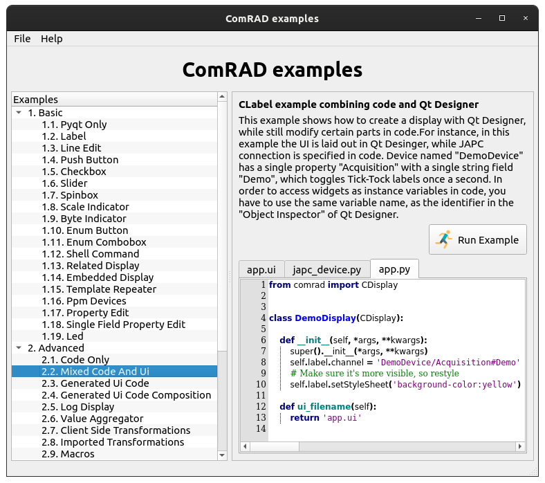
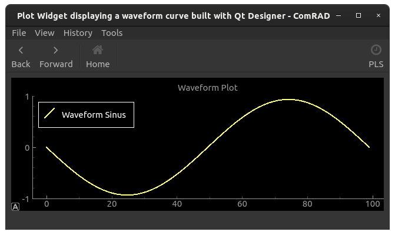

Getting started
===============

Now that you have installed ComRAD as explained in the :doc:`install`, we can start using it.

**Contents:**

- `Workflow`_
- `Interactive examples`_
- `Using ComRAD Designer`_

  * `Launch`_
  * `Create a new form`_
  * `Connect to the control system`_
  * `Preview the form`_

- `Running the application`_

  * `ComRAD main window`_
  * `Using launch profiles`_
  * `Using alternative color schemes`_

- `Hot reloading application's UI`_
- `Releasing the application for operational use`_

Workflow
--------

The typical basic workflow of designing ComRAD applications consists of the following steps:

#. Create a new form in ComRAD designer
#. Layout widgets
#. Specify control system addresses for ComRAD-enabled widgets
#. Connect signals, slots & modify other properties
#. Save the form
#. Open the form inside ComRAD runtime
#. When needed, modify form in ComRAD Designer and reload it in ComRAD runtime app
#. Once the application is complete, release it for deployment

.. note:: For alternative workflows, e.g. mixing ComRAD Designer with Python-based GUIs; or excluding
          ComRAD Designer from the loop altogether, please consult the
          :doc:`basic/index` page.

Interactive examples
--------------------

The simplest way to get familiar with ComRAD capabilities, is to launch the interactive examples.

.. code-block:: bash

   comrad examples

This command will open a browser, that lets you scan through available examples, run them or
inspect the code and Qt Designer files.

   ComRAD examples browser

Examples run under the simulated control system. It means that they never connect to a real device.
This allows each individual example device its data and the logic by which it is produced.

As a bonus, it breaks dependency on real devices, uncontrollably living inside the control system.
And the user is able to run examples without constraints offline or in GPN (while most of the devices
must be accessed from within TN)

Using ComRAD Designer
---------------------

ComRAD Designer is merely a thin wrapper over standard Qt Designer. For the complete guide of how to
use Qt Designer, refer to the `official documentation <https://doc.qt.io/qt-5/qtdesigner-manual.html>`__.

Launch
^^^^^^

To launch ComRAD Designer, use the command line:

.. topic:: New document...

   .. code-block:: bash

      comrad designer

You can specify an existing UI file to be opened in the Designer:

.. topic:: Existing document...

   .. code-block:: bash

      comrad designer my_existing_file.ui

Create a new form
^^^^^^^^^^^^^^^^^

New form starts with the template selection dialog.

   New form dialog

#. Select "Widget" template
#. Click "Create"

.. note:: Most of the time you will need to create new forms with the template "Widget". You should
          never use "Main Window" template in ComRAD applications.

With the new form created, it's time to get familiar with the user interface of the Designer.

   ComRAD Designer tools

- **Your form** will be positioned in the central area of the Designer.
- **Widget box** provides a list of available widgets that you can drag onto the form. These widgets
  are combined from standard PyQt widgets and ComRAD widgets (prefixed with C-, e.g. :ref:`clabel` or
  :ref:`cslider`)
- **Object inspector** will display your view hierarchy as you keep adding new widgets and layouts to the form.
- **Property editor** allows you to customize selected widgets. Here, you will specify control system addresses
  to connect to, among other things.
- **Editing modes** allow you to switch between, say, moving widgets around and connecting signals and slots.
  `More info <https://doc.qt.io/qt-5/designer-editing-mode.html>`__.
- **Layout's quick menu** allows you to assign layouts to widget containers.
  `More information on layouts <https://doc.qt.io/qt-5/designer-layouts.html>`__.

Now you can start dragging widgets from the Widget Box onto your form.

For example, you can locate a widget called "Clabel". This is a ComRAD version of Qt label (:class:`QLabel`,
which is also present in the widget box under the name "Label"). :ref:`clabel` does everything
:class:`QLabel` does but can also connect to the control system. After you've dragged it on the form, select a
desired layout for the form. You can now edit properties of the label.

Connect to the control system
^^^^^^^^^^^^^^^^^^^^^^^^^^^^^

Have a look at the property editor and locate property called ``channel``. This is the address, which tells
ComRAD to connect to a device in the control system. Address almost follows the standard CERN
device-property notation. On the right-hand side of the ``channel`` field, you will see a ``...`` button. Click it to
open a device selector dialog.

   Device selector dialog

The dialog lets you locate the desired devices and their properties by searching CCDB information.

   Device selector with search results

Here you can also assign a cycle selector to be used with PPM devices and choose an alternative protocol,
from the list of supported protocols. Resulting string will be display to you for your information.
The very same string will be set into the ``channel`` property.

Preview the form
^^^^^^^^^^^^^^^^

You can quickly preview the form using native Qt Designer functionality:

#. Click menu "Form" → "Preview..." or use "Ctrl+R"
#. Drag and resize the form to see how your layouts adapt

   Form preview

.. note:: The form preview is not a running application. It allows you to see the static preview but does
          not populate data from the control system.

Running the application
-----------------------

To run the application type the command:

.. code-block:: bash

   comrad run my_existing_file.ui

To see all available options, refer to the help command:

.. code-block:: bash

   comrad run -h

ComRAD main window
^^^^^^^^^^^^^^^^^^

ComRAD decorates user interfaces with common controls that can be customized. Average application will have similar
decorations to the following example:

   Simple ComRAD application window

Various parts of the interface can be shown or hidden via "View" menu in the **Main menu** bar or via launch arguments
(explore ``comrad run -h``).

* **Main menu** provides basic configuration means for the application and the most vital functions. It can also be
  extended with user-defined plugins (:ref:`advanced/plugins:Menu plugins`).
* **Navigation** buttons provide controls similar to that of a web browser, where user can navigate back and forth between
  displays, that are replaced using :ref:`crelateddisplaybutton`. Beside accommodating standard controls, navigation bar
  is capable of embedding user-defined navigation items, using :ref:`advanced/plugins:Navigation bar plugins`.
* **RBAC control** provides means to authenticate, configure user roles and display RBAC token information. More information
  can be found in :doc:`basic/rbac`.
* **Main Log Console** captures Python log output and aggregates it in a resizeable dock widget. To learn more about
  the console, see :ref:`clogconsole`.
* **Status bar** can provide status information, such as loading progress of a file. It can also be extended with
  :ref:`custom plugins <advanced/plugins:Status bar plugins>`.
* **Timing control** allows selecting a timing user for the entire application. When timing users must be applied only to
  a part of the application :ref:`ccontextframe` can be employed. In addition, **Timing control** provides configuration
  and ability to show the timing bar, as shown below. More information about timing can be found in :doc:`basic/timing`.

   Simple application with timing bar enabled

Using launch profiles
^^^^^^^^^^^^^^^^^^^^^

ComRAD integrates with argparse-profiles_, which allows its "comrad run" command to save and load a list of
command arguments from a profile. For example, to save a profile for the first time, you would use ``--save-to-profile``,
e.g.

.. code-block:: bash

   comrad run --save-to-profile MY_PROFILE -s PSB.USER.ALL --window-plugin-config comrad.pls.show_bar=1 -- my_existing_file.ui

Later, to not type same arguments everytime, you could simply call

.. code-block:: bash

   comrad run --use-profile MY_PROFILE

and this would be equivalent to launching

.. code-block:: bash

   comrad run -s PSB.USER.ALL --window-plugin-config comrad.pls.show_bar=1 -- my_existing_file.ui

.. seealso:: Refer to argparse-profiles_ documentation for the complete guide of managing profiles.

.. _argparse-profiles: https://acc-py.web.cern.ch/gitlab/acc-co/devops/python/incubator/argparse-profiles/docs/stable/

Using alternative color schemes
^^^^^^^^^^^^^^^^^^^^^^^^^^^^^^^

ComRAD provides ways to specify alternative stylesheet for the application or its individual components.
Styling is done using `Qt Style Sheet (QSS) notation <https://doc.qt.io/qt-5/stylesheet-customizing.html>`__,
which is a derivative of a web standard, called
`Cascading Style Sheet (CSS) <https://www.w3schools.com/Css/css_intro.asp>`__.

You can provide your custom QSS file while launching an application, using ``--stylesheet`` argument, e.g.

.. code-block:: bash

   comrad run --stylesheet /path/to/my.qss my_existing_file.ui

Alternatively, you can stylize individual widgets in ComRAD Designer by manipulating :attr:`styleSheet <QWidget.styleSheet>` property.
You can also stylize it in code, by using :py:meth:`QWidget.setStyleSheet` or :meth:`QWidget.setStyle` calls.

For convenience, ComRAD ships with the "Dark mode" predefined scheme to invert the colors of the interface.

.. code-block:: bash

   comrad run --dark-mode my_existing_file.ui

It can be enabled by default via environment variables:

.. code-block:: bash

   export COMRAD_DARK_MODE_ENABLED=1
   comrad run my_existing_file.ui

.. table::
   :widths: 1 1

   =================  =============
   **Default style**  **Dark mode**
   |lightmode|        |darkmode|
   =================  =============

.. |lightmode| image:: img/light_mode.png
   :alt: Application with default style

.. note:: "Dark mode" color scheme will have to be gradually polished in the future to have enough contrast
          in every situation. Your input is always welcome, and if you want to update the QSS, let us know!

Hot reloading application's UI
------------------------------

When using ComRAD Designer to prepare your UI, you don't need to repeatedly re-run the application. Instead,
you can reload the UI from within the application.

Similar to Qt Designer's "Preview..." , menu "File" → "Reload Display" is attached to Ctrl+R.

When launching from the command line, you can open applications in a non-blocking way, thus launching both
ComRAD Designer and the application from the same shell, e.g.

.. topic:: Open several applications from the same shell

   .. code-block:: bash

      comrad designer my_existing_file.ui &
      comrad run my_existing_file.ui &

Afterwards, you can keep switching between the two, saving ComRAD Designer form with Ctrl+S, while
refreshing UI in the application with Ctrl+R.

.. raw:: html

   <video style="width: 100%" controls src="_static/hot_reload.mp4"></video>

Releasing the application for operational use
---------------------------------------------

Once the development of the application has reached the milestone, where it can be made available to the users,
next step is to package the application that it can be easily installed elsewhere. In the packaged application,
users do not invoke "comrad run", hence they are not obliged to ensure that ComRAD is installed in a proper
environment. Instead, they would invoke it like any other PyQt application.

.. seealso:: Packaging and deployment is explained in more detail in :doc:`deploy`.
